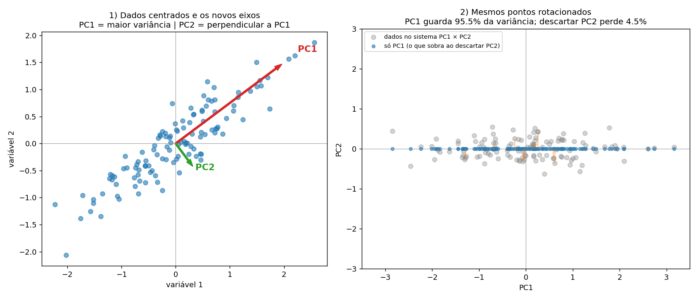

# DISCIPLINA: APRENDIZADO DE MÁQUINA NÃO SUPERVISIONADO (262GGR6044A)

**Graduação em Inteligência Artificial, FMU** · Compilação de 04/10/2026 · Aulas 1 a 4

> **Status:** compilação completa das quatro aulas, com pendências declaradas na Parte 9 (observações da Aula 2 e materiais externos não acessados). Não é uma versão "final fechada".

**Legenda de origem (usada em todo o documento):**
- **Material acadêmico:** o que consta nos capítulos, infográficos, slides e atividades da FMU.
- **Observação da Dani:** interpretações, dúvidas e decisões da Dani.
- **Complementação:** explicações, exemplos e cuidados acrescentados para estudo. **Não são do livro nem do professor** e estão sempre marcados como *(complementação)*.

## Índice

- [Parte 0. Visão geral da disciplina](#parte-0-visão-geral-da-disciplina)
  - [0.1 Identificação](#01-identificação)
  - [0.2 Aulas, materiais e atividades](#02-aulas-materiais-e-atividades)
  - [0.3 Objetivos de aprendizagem por aula (material acadêmico)](#03-objetivos-de-aprendizagem-por-aula-material-acadêmico)
  - [0.4 Fio condutor: como as aulas se encaixam](#04-fio-condutor-como-as-aulas-se-encaixam)
  - [0.5 Mapa de conceitos recorrentes: onde está o conteúdo completo](#05-mapa-de-conceitos-recorrentes-onde-está-o-conteúdo-completo)
  - [0.6 Como esta compilação evita repetição](#06-como-esta-compilação-evita-repetição)
- [AULA 1 — Qualidade de dados, Machine Learning e Deep Learning](#aula-1--qualidade-de-dados-machine-learning-e-deep-learning)
  - [1.1 Resumo e escopo](#11-resumo-e-escopo)
  - [1.2 Dificuldades da limpeza de dados (material acadêmico: slide da aula)](#12-dificuldades-da-limpeza-de-dados-material-acadêmico-slide-da-aula)
  - [1.3 Inteligência Artificial: Mitos e Verdades (livro-base)](#13-inteligência-artificial-mitos-e-verdades-livro-base)
  - [1.4 Engenharia do Conhecimento (livro-base)](#14-engenharia-do-conhecimento-livro-base)
  - [1.5 Machine Learning (livro-base)](#15-machine-learning-livro-base)
  - [1.6 Deep Learning e Redes Neurais Artificiais (RNA) (livro-base + slide da aula — ponto que a Dani identificou como pouco aprofundado na aula)](#16-deep-learning-e-redes-neurais-artificiais-rna-livro-base--slide-da-aula--ponto-que-a-dani-identificou-como-pouco-aprofundado-na-aula)
  - [1.7 Big Data (livro-base)](#17-big-data-livro-base)
  - [1.8 Exemplos e material prático](#18-exemplos-e-material-prático)
- [AULA 2 — Análise multivariada de dados e agrupamento (k-means)](#aula-2--análise-multivariada-de-dados-e-agrupamento-k-means)
  - [2.1 Resumo e contexto](#21-resumo-e-contexto)
  - [2.2 Conceito de Análise Multivariada de Dados](#22-conceito-de-análise-multivariada-de-dados)
  - [2.3 Formas de Condução da Análise Multivariada](#23-formas-de-condução-da-análise-multivariada)
  - [2.4 Tipos de Visualização de Dados Multivariados](#24-tipos-de-visualização-de-dados-multivariados)
  - [2.5 Machine Learning — Agrupamento (Clustering)](#25-machine-learning--agrupamento-clustering)
  - [2.6 Experimento de laboratório virtual: "Agrupamento das Flores"](#26-experimento-de-laboratório-virtual-agrupamento-das-flores)
- [AULA 3 — PCA e tratamento de outliers](#aula-3--pca-e-tratamento-de-outliers)
  - [3.1 Resumo e contexto](#31-resumo-e-contexto)
  - [3.2 PCA × Análise Fatorial (infográfico da unidade)](#32-pca--análise-fatorial-infográfico-da-unidade)
  - [3.3 PCA — Conceitos Básicos (livro-base: Soares)](#33-pca--conceitos-básicos-livro-base-soares)
  - [3.4 PCA — Metodologia (passo a passo)](#34-pca--metodologia-passo-a-passo)
  - [3.5 PCA — Aplicações](#35-pca--aplicações)
  - [3.6 Outliers — Conceito (livro-base: Miranda + infográfico)](#36-outliers--conceito-livro-base-miranda--infográfico)
  - [3.7 Método do Intervalo Interquartil (IQR) e Box-plot](#37-método-do-intervalo-interquartil-iqr-e-box-plot)
  - [3.8 Outliers Multivariados — Distância de Mahalanobis](#38-outliers-multivariados--distância-de-mahalanobis)
  - [3.9 Remover ou não remover? (o que o material diz)](#39-remover-ou-não-remover-o-que-o-material-diz)
  - [3.10 PCA em profundidade (complementação — aprofundamento pedido pela Dani)](#310-pca-em-profundidade-complementação--aprofundamento-pedido-pela-dani)
  - [3.11 Bibliotecas usadas nos códigos do capítulo](#311-bibliotecas-usadas-nos-códigos-do-capítulo)
  - [3.12 Código do capítulo (preservado)](#312-código-do-capítulo-preservado)
  - [3.13 Receita prática: identificar e remover outliers (complementação)](#313-receita-prática-identificar-e-remover-outliers-complementação)
  - [3.14 Prática no VS Code: pacote `2_Laboratorios/aula03_vscode/` (complementação)](#314-prática-no-vs-code-pacote-aula03_vscode-complementação)
  - [3.15 Inconsistências e pontos de atenção do material (complementação)](#315-inconsistências-e-pontos-de-atenção-do-material-complementação)
- [AULA 4 — AED (revisão) e Self-service analytics](#aula-4--aed-revisão-e-self-service-analytics)
  - [4.1 Resumo e contexto](#41-resumo-e-contexto)
  - [4.2 AED em modo revisão: o que é novo nesta unidade](#42-aed-em-modo-revisão-o-que-é-novo-nesta-unidade)
  - [4.3 Self-service analytics: conceito e importância](#43-self-service-analytics-conceito-e-importância)
  - [4.4 Níveis de autoatendimento (material acadêmico: Alpar e Schulz, 2016)](#44-níveis-de-autoatendimento-material-acadêmico-alpar-e-schulz-2016)
  - [4.5 Estratégias em self-service analytics (material acadêmico: Halper, 2020)](#45-estratégias-em-self-service-analytics-material-acadêmico-halper-2020)
  - [4.6 BI tradicional × Self-service BI (material acadêmico: infográfico)](#46-bi-tradicional--self-service-bi-material-acadêmico-infográfico)
  - [4.7 Ferramentas citadas no material (material acadêmico)](#47-ferramentas-citadas-no-material-material-acadêmico)
  - [4.8 Análise crítica: observações da Dani e leitura do material](#48-análise-crítica-observações-da-dani-e-leitura-do-material)
  - [4.9 Complementação: onde fica a transformação (ETL × ELT) e arquitetura típica](#49-complementação-onde-fica-a-transformação-etl--elt-e-arquitetura-típica)
  - [4.10 Cenários de vida real: "Imagine que..." (complementação)](#410-cenários-de-vida-real-imagine-que-complementação)
- [Parte 5. Integração entre as aulas](#parte-5-integração-entre-as-aulas)
  - [5.1 Conexões entre as aulas](#51-conexões-entre-as-aulas)
  - [5.2 Conexões com a disciplina anterior (Aquisição e Preparação de Dados, 262GGR6046A)](#52-conexões-com-a-disciplina-anterior-aquisição-e-preparação-de-dados-262ggr6046a)
  - [5.3 Conexões com Aprendizado de Máquina Supervisionado](#53-conexões-com-aprendizado-de-máquina-supervisionado)
  - [5.4 Guia de decisão integrado (complementação)](#54-guia-de-decisão-integrado-complementação)
  - [5.5 Regras transversais](#55-regras-transversais)
- [Parte 6. Atividades avaliativas: gabaritos e pegadinhas](#parte-6-atividades-avaliativas-gabaritos-e-pegadinhas)
  - [6.0 Resumo](#60-resumo)
  - [6.1 Atividade 2 (A2): gabarito](#61-atividade-2-a2-gabarito)
  - [6.2 Atividade 3 (A3): gabarito](#62-atividade-3-a3-gabarito)
  - [6.3 Atividade 4 (A4): gabarito](#63-atividade-4-a4-gabarito)
  - [6.4 Padrões de pegadinha (todas as atividades)](#64-padrões-de-pegadinha-todas-as-atividades)
- [Parte 7. Observações e dúvidas da Dani](#parte-7-observações-e-dúvidas-da-dani)
  - [Aula 1](#aula-1)
  - [Aula 2](#aula-2)
  - [Aula 3](#aula-3)
  - [Aula 4](#aula-4)
- [Parte 8. Anexos](#parte-8-anexos)
  - [Anexo A. Estrutura de arquivos da disciplina no repositório](#anexo-a-estrutura-de-arquivos-da-disciplina-no-repositório)
  - [Anexo B: Vídeo "Análise de dados em Python" (material do professor, não assistido)](#anexo-b-vídeo-análise-de-dados-em-python-material-do-professor-não-assistido)
  - [Anexo C: Anaconda em uma página (complementação, não deriva do vídeo)](#anexo-c-anaconda-em-uma-página-complementação-não-deriva-do-vídeo)
  - [Anexo D. Links do material (não acessados)](#anexo-d-links-do-material-não-acessados)
- [Parte 9. Pendências e limitações](#parte-9-pendências-e-limitações)
- [Parte 10. Referências consolidadas](#parte-10-referências-consolidadas)
  - [Aula 1](#aula-1-1)
  - [Aula 2](#aula-2-1)
  - [Aula 3](#aula-3-1)
  - [Aula 4](#aula-4-1)

---

## Parte 0. Visão geral da disciplina

### 0.1 Identificação

| Item | Informação |
|---|---|
| **Disciplina** | Aprendizado de Máquina Não Supervisionado |
| **Código** | 262GGR6044A |
| **Curso** | Graduação em Inteligência Artificial, FMU |
| **Aulas** | 4 (Unidades 1 a 4) |
| **Disciplina anterior** | Aquisição e Preparação de Dados (262GGR6046A) |

### 0.2 Aulas, materiais e atividades

| Aula | Tema | Material-base | Atividade |
|---|---|---|---|
| **1** | Qualidade de dados, IA, Machine Learning e Deep Learning | *Engenharia do Conhecimento e Inteligência Artificial* (C. S. Barbosa) e slides | Não registrada |
| **2** | Análise multivariada de dados e agrupamento (k-means) | *Preparação e Análise Exploratória de Dados* (R. Albuquerque) e experimento "Agrupamento das Flores" | A2: 3 de 5 |
| **3** | PCA e tratamento de outliers | *Aprendizado de Máquina* (J. Soares, PCA) e *Preparação e Análise Exploratória de Dados* (L. B. A. de Miranda, outliers) | A3: 2 de 5 (nota 4), tentativa 1 de 2 |
| **4** | AED (revisão) e Self-service analytics | *Preparação e Análise Exploratória de Dados* (R. G. C. Ferreira, AED) e *Analytics para Big Data* (J. A. Soares, self-service) | A4: resultado não informado |

### 0.3 Objetivos de aprendizagem por aula *(material acadêmico)*

- **Aula 1:** comparar mitos e verdades sobre IA; relacionar a engenharia do conhecimento à criação de sistemas inteligentes; reconhecer as principais tecnologias e ferramentas para aplicações inteligentes e análise de dados.
- **Aula 2:** conceituar a análise multivariada; descrever as formas de condução; identificar o tipo de visualização e as respectivas variáveis. *(Objetivos do experimento de k-means: seção 2.6.)*
- **Aula 3:** conceituar a PCA, descrever sua metodologia e identificar aplicações em ML; definir outliers, identificá-los por intervalo interquartil e box-plots e decidir sobre sua remoção conforme a base de dados.
- **Aula 4:** definir o processo de análise exploratória, descrever suas etapas e reconhecer sua importância; reconhecer o papel do autoatendimento, aplicar técnicas de busca de insights e apontar estratégias de autoatendimento.

### 0.4 Fio condutor: como as aulas se encaixam

| Etapa do trabalho com dados | O que resolve | Onde está |
|---|---|---|
| **Base conceitual** | O que são IA, ML (supervisionado, não supervisionado, reforço), Deep Learning e Big Data | Aula 1 |
| **Qualidade e tratamento** | Ruído, inconsistência, redundância e incompletude; valores ausentes; outliers | Aula 1 (conceito), Aula 4 (ausentes), Aula 3 (outliers) |
| **Exploração e visualização** | Entender relações entre muitas variáveis | Aula 2 |
| **Redução de dimensionalidade** | Resumir muitas variáveis correlacionadas | Aula 2 (análise fatorial) e Aula 3 (PCA) |
| **Descoberta de grupos** | Agrupar sem rótulo | Aula 1 (conceito) e Aula 2 (k-means) |
| **Uso organizacional** | Quem analisa e com que governança | Aula 4 (self-service) |

### 0.5 Mapa de conceitos recorrentes: onde está o conteúdo completo

Cada conceito é explicado **uma única vez**, na seção de origem. As demais aulas apenas apontam para ela.

| Conceito | Explicação completa | Reaparece (apenas como ponteiro) |
|---|---|---|
| Qualidade de dados (ruído, inconsistência, redundância, incompletude) | 1.2 | 3.6 (outliers), 4.2 (ausentes) |
| ML supervisionado × não supervisionado × reforço | 1.5 | 2.5 (k-means sem rótulo), 3.10.8 (PCA no supervisionado) |
| Agrupamento (clustering) | Conceito: 1.5. Algoritmo: 2.5 | 2.3 (técnica de interdependência) |
| Redução de dimensionalidade | PCA: 3.3 a 3.10. Fatorial: 3.2 | 2.3 (análise fatorial) |
| Padronização e normalização | Disciplina anterior; necessidade para a PCA em 3.10.0 e 3.10.7 | 2.5 (etapa 1 do agrupamento) |
| Outliers: definição, IQR, Mahalanobis, decisão | 3.6 a 3.9 e 3.13 | 4.2.2 (análise separada), 1.2 (ruído) |
| Valores ausentes e imputação | 4.2.3 | 1.2 (incompletos) |
| Visualização multivariada (heatmap, scatter, densidade) | 2.4 | 3.7 (box-plot), 4.7 (ferramentas de BI) |
| Vazamento de dados (ajustar só no treino) | 3.10.8 | 4.2.6 (imputação) |
| Big Data (5 Vs) | 1.7 | 4.3.1 (volume por minuto) |
| ETL, ELT, DW, OLAP | Disciplina anterior; 4.9.1 (ETL × ELT) | 4.8 (análise crítica) |
| Detecção de anomalias | 1.5 (conceito) | 3.8 (Mahalanobis), 3.10.11 (erro de reconstrução), 4.2.2 (fraude) |
| Variáveis métricas × não métricas | 2.2 | 2.3 (escolha da técnica), 3.10.7 (PCA exige numéricas) |

### 0.6 Como esta compilação evita repetição

1. O conteúdo fica **no lugar de origem**; reaparições viram ponteiros (seção 0.5).
2. **Conexões, gabaritos, observações, anexos e referências** estão consolidados em partes próprias (5 a 10), em vez de repetidos ao fim de cada aula.
3. As tabelas de termos e de usos da PCA foram unificadas (3.10.0 e 3.10.2).
4. O capítulo de AED da Aula 4 é o mesmo da disciplina anterior: aparece só como **revisão**, com o que é novo.
5. A numeração é por aula (seção 3.10 = Aula 3); as Partes 1 a 4 são as próprias aulas.
6. Padrão de exemplos, a pedido da Dani: tabelas com **"quando usar"** e exemplos teóricos e reais, e cenários no formato **"Imagine que..."**.


---

## AULA 1 — Qualidade de dados, Machine Learning e Deep Learning

**Livro-base:** *Engenharia do Conhecimento e Inteligência Artificial* — Cynthia da Silva Barbosa (SAGAH), com slides de apoio (limpeza de dados; Deep Learning e RNA).
**Atividade avaliativa:** não registrada.

### 1.1 Resumo e escopo

A Aula 1 retoma a importância da **estruturação e qualidade dos dados** — tema que conecta diretamente com a disciplina anterior (Aquisição e Preparação de Dados) — e introduz o panorama de **Inteligência Artificial**, **Engenharia do Conhecimento**, **Machine Learning** (supervisionado e não supervisionado) e **Deep Learning**, que serão a base conceitual do restante da disciplina de Aprendizado Não Supervisionado.

**Escopo:** a normalização de dados foi mencionada na aula, mas **não é registrada aqui**, por já ter sido coberta em detalhe na disciplina anterior (Aquisição e Preparação de Dados).

### 1.2 Dificuldades da limpeza de dados *(material acadêmico: slide da aula)*

O termo *limpeza dos dados* existe porque nem sempre os dados têm a qualidade esperada. Quatro problemas típicos:

| Tipo | Definição |
|---|---|
| **Dados ruidosos** | Apresentam valores ou erros que divergem do esperado (ex.: idade = 450) |
| **Dados inconsistentes** | Contradizem os valores de atributos do mesmo objeto — comum em etapas de integração de tabelas diferentes (ex.: mesma pessoa com idades diferentes em registros distintos) |
| **Dados redundantes** | Os valores dos atributos dos objetos se repetem |
| **Dados incompletos** | Há detecção de ausência de valores ou de parte de algum dado |

*(Exemplos ilustrados com uma tabela de Nome/Idade/Telefone contendo os quatro tipos de problema.)*

### 1.3 Inteligência Artificial: Mitos e Verdades *(livro-base)*

O conceito de IA surgiu em **1956**, com o objetivo de imitar o comportamento humano por meio de computadores.

A IA já está presente no cotidiano (Google Maps/Waze, buscadores, Netflix) e em praticamente todos os setores: indústria, vendas/marketing, saúde, segurança, ensino, robótica, ciência de dados.

**Quadro de mitos x realidade (livro):**

| Mito | Realidade |
|---|---|
| A IA substituirá o trabalho de desenvolvedores | A IA muda funções existentes e cria novas posições |
| Tomará decisões e fará diagnósticos médicos de altíssima complexidade | O profissional de saúde ainda decide; a IA acelera o processo |
| Controlará pessoas | É usada para automatização e produtividade |
| Não compreenderá as necessidades do cliente | Melhora o relacionamento (ex.: chatbots) |
| Dificilmente identificará pessoas | Identificação facial e reconhecimento de voz são aplicações fortes |
| Não preverá tendências futuras | Realiza previsões com base em pesquisas e análises |

**Classificação da IA (Mussa, 2020):**
- **IA genérica/forte:** máquinas realizariam todas as tarefas humanas, incluindo pensar e autoaprimorar-se — hipótese de singularidade. Ainda não comprovada; exemplo citado (Deep Blue x Kasparov, 1997) é IA estreita disfarçada de "forte".
- **IA estreita/fraca:** realiza tarefas específicas (tradução, reconhecimento facial, filtro de spam). É a base deste capítulo e da maioria das aplicações reais (Google, Amazon, Facebook, Alibaba, Waze, Uber).

### 1.4 Engenharia do Conhecimento *(livro-base)*

Originalmente, consistia em criar **sistemas especialistas** transferindo o conhecimento de profissionais especialistas — abordagem que se mostrou limitada (raciocínio humano é incerto e varia de profissional para profissional).

Evoluiu para uma abordagem de **modelagem computacional**, dando origem aos **sistemas de conhecimento** (sistemas especialistas + sistemas baseados em conhecimento), que são a base da IA.

**Hierarquia (Figura 1 do livro):**
```
Inteligência Artificial
 └─ Sistemas Inteligentes
     └─ Sistemas Baseados em Conhecimento
         └─ Sistemas Especialistas
```

**Características dos sistemas inteligentes:**
- Utilizam conhecimento para realizar atividades ou solucionar problemas.
- Realizam associações para lidar com problemas complexos.
- Armazenam e recuperam grandes volumes de informação para apoiar decisões.

**Atividades típicas da engenharia do conhecimento:** interpretação/análise de dados, classificação, monitoramento de sistemas, planejamento, previsão, projeto.

### 1.5 Machine Learning *(livro-base)*

Objetivo: compreender a estrutura dos dados e adaptá-los a modelos conhecidos, facilitando interpretação, análise e predição via algoritmos. Característica central: **aprender com os dados fornecidos**.

**Exemplo do livro (fraude em cartão de crédito):** se uma pessoa compra sempre em Belo Horizonte/MG, presencialmente ou pela internet, a operadora pode usar machine learning para identificar como suspeita uma compra feita em outra cidade.

#### Supervisionado
Possui resultado esperado conhecido durante o treinamento.
- **Classificação:** classifica o novo dado com base em critérios aprendidos no treino (ex.: tumor benigno/maligno).
- **Regressão:** gera uma função que descreve como uma variável se comporta em relação a outras (ex.: estimar idade de uma pessoa).

#### Não supervisionado
Computadores aprendem padrões, conceitos e dados **não rotulados**, sem supervisão — identificam semelhanças com base em padrões/repetições.
- **Agrupamento (clustering):** dados agrupados por similaridade (ex.: agrupar clientes por preferência).
- **Associação:** procura padrões relacionados entre atributos (ex.: produtos vendidos em conjunto).
- **Sumarização:** busca descrição simples e compacta de um conjunto de dados (ex.: sumarizar notícias).
- Também usado em **detecção de anomalias** (peças defeituosas, fraude).

> Esta é a categoria central da disciplina atual (Aprendizado de Máquina Não Supervisionado).

#### Aprendizagem por reforço
Baseada em punição de ações negativas e recompensa por ações positivas. A máquina testa caminhos, avalia o resultado e ajusta estratégia quando insatisfatório. Usada em algoritmos financeiros/de investimento.

### 1.6 Deep Learning e Redes Neurais Artificiais (RNA) *(livro-base + slide da aula — ponto que a Dani identificou como pouco aprofundado na aula)*

**Deep Learning** é a parte avançada do Machine Learning, técnica para extração automatizada de padrões de grandes volumes de dados, modelando-os em alto nível de abstração (Schmidhuber, 2015). Usa **Redes Neurais Artificiais (RNAs)** como base — RNAs imitam o funcionamento dos neurônios do sistema nervoso.

**Como a RNA processa informação (slide da aula):**
1. Os neurônios processam dados para reconhecer padrões (ex.: reconhecimento facial, reconhecimento de fala).
2. A informação passa por camadas: a **camada de entrada** recebe os dados, as **camadas ocultas** (intermediárias) processam, a **camada de saída** produz o resultado. Cada camada é tipicamente um algoritmo simples e uniforme com uma função de ativação.
3. O Deep Learning aprende com seus erros via **Back Propagation**: o resultado da rede é comparado ao esperado (Comparador), o erro é calculado e retropropagado pela rede para ajustar os pesos.

**Exemplo funcional (livro):** porta lógica AND — a rede neural calcula a função com base em duas entradas booleanas; só é verdadeira quando ambas as entradas são verdadeiras. Serve de analogia didática para como a RNA combina entradas para gerar uma saída.

**Classificação das técnicas de Deep Learning (livro):**
- **Redes para aprendizado supervisionado:** auxiliam na classificação de padrões conforme a distribuição das classes.
- **Redes de aprendizado não supervisionado (ou de geração):** identificam relações em dados não rotulados; dados visíveis são caracterizados por distribuições estatísticas conjuntas.
- **Redes híbridas:** combinam métodos generativos e discriminativos.

**CNN (Convolutional Neural Network):** classe de rede neural voltada à análise e processamento de imagens digitais. Exemplo citado (Krizhevsky, Sutskever e Hinton, 2012): CNN com 60 milhões de parâmetros e 650 mil neurônios em 5 camadas convolucionais, treinada para classificar mais de 1 milhão de imagens do banco ImageNet.

**Aplicações de Deep Learning:** processamento/reconhecimento de imagens, identificação de doenças, desenvolvimento de medicamentos, reconhecimento facial e de fala.

**Ferramentas citadas:** Knime (código aberto, integração/análise/mineração de dados), Deeplearning4J (framework Java, voltado a negócios), Lasagne (abstrai complexidade de DL, interface em Python).

### 1.7 Big Data *(livro-base)*

Grande base de dados em repositórios, não necessariamente estruturados. Os **5 V's** (Barbieri, 2011):

| V | Descrição |
|---|---|
| **Volume** | Coleta por diversas fontes (redes sociais, navegadores, e-commerce) |
| **Velocidade** | Ritmo de geração de dados por celulares, sensores etc. |
| **Veracidade** | Necessidade de verificar se as informações são verdadeiras |
| **Variedade** | Dados estruturados ou não, de diferentes fontes (vídeo, áudio, e-mail) |
| **Valor** | Dados agregam valor à tomada de decisão organizacional |

**Ferramenta citada:** Hadoop (open source, processa grandes volumes em arquitetura cluster/servidores distribuídos). Exemplos de uso: Walmart e Nike para pesquisa de mercado e perfil de consumo.

**Outras tecnologias mencionadas (aplicadas à robótica/IA):**
- **Transfer learning:** reaproveita conhecimento adquirido na resolução de um problema em outro problema similar.
- **Reinforcement learning:** agentes inteligentes agem em um ambiente maximizando recompensa.
- **GAN (Generative Adversarial Network):** gera conteúdo cuja autenticidade não é evidente na avaliação.

### 1.8 Exemplos e material prático

Nenhum código foi apresentado nesta aula. Os exemplos (tabela Nome/Idade/Telefone, porta lógica AND, reconhecimento facial e de fala, CNN/ImageNet, Walmart e Nike, fraude de cartão) estão nas seções onde cada conceito é apresentado.

---

## AULA 2 — Análise multivariada de dados e agrupamento (k-means)

**Livro-base (parte 1):** *Preparação e Análise Exploratória de Dados* — Rafael Albuquerque (SAGAH), capítulo "Análise multivariada de dados".
**Material complementar (parte 2):** experimento e roteiro de laboratório virtual "Machine Learning: Agrupamento das Flores" (sumário teórico baseado em Faceli et al., 2021 e Lenz et al., 2020).
**Atividade avaliativa:** A2 (ver Parte 6).

### 2.1 Resumo e contexto

A Aula 2 tem dois blocos de conteúdo complementares:

1. **Análise multivariada de dados** — fundamentos estatísticos para analisar múltiplas variáveis simultaneamente, dividida em técnicas de dependência (causa-efeito) e interdependência (padrões subjacentes sem variável dependente definida), além de formas de visualização desses dados.
2. **Machine Learning — Agrupamento (clustering)**, com foco no algoritmo **k-means**, primeira técnica de aprendizado não supervisionado detalhada na disciplina em nível de algoritmo e implementação prática (laboratório virtual com o dataset de flores íris).

Esse segundo bloco é o primeiro contato direto da disciplina com uma técnica central de **aprendizado não supervisionado** propriamente dito — o tema que dá nome à disciplina.

### 2.2 Conceito de Análise Multivariada de Dados

Segundo Hair et al. (2009), análise multivariada é um conjunto de técnicas estatísticas que são extensões de métodos de análise **univariada** (uma variável) e **bivariada** (duas variáveis). Para um problema ser considerado multivariado, todas as variáveis envolvidas devem ser **aleatórias e relacionadas**, de modo que seus efeitos não sejam interpretados separadamente.

Os dados multivariados podem ser representados como uma **matriz de informações**, em que cada linha é uma amostra de cada variável e **xij** é a medida da variável *j* sobre o item/indivíduo *i*.

#### Conceitos fundamentais

- **Variável estatística:** combinação linear de variáveis, alicerce da análise multivariada. Escrita matemática: `w1·X1 + w2·X2 + w3·X3 + ... + wn·Xn`, onde Xn é a variável observada e wn é o peso determinado pela técnica multivariada.
- **Escalas de medida:**
  - **Métricas:** usadas em quantidade/grau (escalas intervalares e de razão) — permitem o mais alto nível de precisão.
  - **Não métricas:** apontam diferença de tipo/natureza, indicando presença ou ausência de uma característica.
- **Erro de medida:** grau em que os valores observados divergem do valor "verdadeiro"/esperado de uma variável — ligado à imprecisão da coleta.

A análise multivariada se divide em **técnicas exploratórias** (simplificação da estrutura de variabilidade dos dados) e **técnicas de inferência**.

### 2.3 Formas de Condução da Análise Multivariada

Duas categorias, segundo o tipo de relacionamento entre as variáveis:

#### Técnicas de Dependência
Uma variável (ou conjunto) é **dependente** de outras (**independentes**), em relação de causa-efeito. Buscam descrever ou prever valores.

> **Atenção, inconsistência do capítulo *(complementação)*:** em uma passagem, o capítulo diz que as variáveis *independentes* são as que o modelo tentará prever ou explicar, e que as *dependentes* são as que afetam as independentes. Isso está **invertido** em relação à definição padrão: a **dependente** é a prevista ou explicada, e as **independentes** a explicam. Use a definição padrão, que é a coerente com os exemplos do próprio capítulo (ex.: despesas com jantares como dependente).

> **Atenção, inconsistência do capítulo *(complementação)*:** em uma passagem, o capítulo diz que as variáveis *independentes* são as que o modelo tentará prever ou explicar, e que as *dependentes* são as que afetam as independentes. Isso está **invertido** em relação à definição padrão: a **dependente** é a prevista ou explicada, e as **independentes** a explicam. Use a definição padrão, que é a coerente com os exemplos do próprio capítulo (ex.: despesas com jantares como dependente).

| Técnica | Quando usar | Exemplo teórico (livro) | Exemplo real de aplicação *(complementação)* |
|---|---|---|---|
| **Regressão múltipla** | Quando há **uma única variável dependente métrica**, relacionada a duas ou mais variáveis independentes métricas, e o objetivo é prever/explicar mudanças nela. | Despesas mensais com jantares fora (dependente) previstas por renda familiar, tamanho da família e idade do chefe de família (independentes). | Imobiliárias estimando o preço de um imóvel (dependente) a partir de metragem, nº de quartos, distância do centro e idade do imóvel (independentes). |
| **Análise conjunta** | Quando se quer avaliar a **importância de atributos e seus níveis** na aceitação de um produto/serviço/ideia, testando combinações de variáveis não métricas. | Avaliação de aceitação de novos produtos/serviços. | Empresas de eletrônicos testando combinações de cor, capacidade de bateria e preço para definir a configuração "ideal" de um novo smartphone. |
| **Análise discriminante múltipla (MDA)** | Quando a variável dependente é **não métrica**, dicotômica ou multicotômica, e o objetivo é classificar entidades em grupos conhecidos. | Distinguir consumidores de marcas nacionais x importadas. | Bancos classificando solicitantes de crédito em "aprovado" x "negado" com base em renda, histórico e idade. |
| **MANOVA / MANCOVA** | Quando há **várias variáveis independentes não métricas** (tratamentos) e **duas ou mais variáveis dependentes métricas** a serem analisadas simultaneamente. | Explorar relações entre tratamentos categóricos e variáveis métricas. | Indústria farmacêutica avaliando o efeito de diferentes dosagens de um medicamento (tratamento) sobre pressão arterial e frequência cardíaca (duas dependentes) ao mesmo tempo. |
| **Análise de correlação canônica** | Quando se quer correlacionar simultaneamente **diversas** variáveis dependentes métricas com **diversas** variáveis independentes métricas. | Obter pesos que maximizem a correlação entre os dois conjuntos de variáveis. | Estudos de RH relacionando um conjunto de indicadores de satisfação no trabalho com um conjunto de indicadores de desempenho (produtividade, absenteísmo, qualidade). |
| **Modelagem de equações estruturais** | Quando o problema envolve **várias variáveis dependentes** inter-relacionadas, exigindo várias regressões múltiplas estimadas ao mesmo tempo. | Estimação conjunta de várias equações de regressão. | Pesquisas de marketing testando, em um único modelo, como marca, qualidade percebida e preço influenciam simultaneamente satisfação e lealdade do cliente. |

#### Técnicas de Interdependência
Nenhuma variável é definida como dependente/independente — todas são analisadas simultaneamente para entender **padrões subjacentes** aos dados, sem suposições prévias sobre as variáveis.

| Técnica | Quando usar | Exemplo teórico (livro) | Exemplo real de aplicação *(complementação)* |
|---|---|---|---|
| **Análise fatorial** | Quando há muitas variáveis correlacionadas entre si e se quer **reduzir a dimensionalidade**, condensando-as em fatores/componentes menores. | *(não detalhado no capítulo-base desta aula; ver PCA × Análise Fatorial na seção 3.2)* | Pesquisas de satisfação com dezenas de perguntas sendo reduzidas a poucos "fatores" latentes (ex.: "atendimento", "preço", "qualidade do produto"). |
| **Análise de cluster (agrupamento)** | Quando se quer **classificar entidades em grupos não predefinidos**, com base apenas em similaridade entre elas. | Reconhecimento de grupos de consumidores com características semelhantes. | Plataformas de streaming agrupando usuários por padrão de consumo para gerar recomendações (conecta com o algoritmo k-means da seção 2.5). |
| **Escala multidimensional** | Quando o objetivo é **mapear percepções** de similaridade/preferência em um espaço multidimensional, sem dados métricos diretos. | Detectar produtos com perfil de consumidor semelhante. | Pesquisas de posicionamento de marca, mapeando como consumidores percebem a proximidade entre marcas concorrentes (ex.: Coca-Cola x Pepsi x marcas próprias). |
| **Análise de correspondência** | Quando se quer mapear a relação entre **variáveis não métricas categóricas**, algo que outras técnicas interdependentes não cobrem. | Correlacionar marcas de celular com perfis de consumidores (adolescentes, adultos, idosos). | Pesquisas eleitorais relacionando partido/candidato (categórico) com faixa etária ou região (categórico), identificando associações visuais em um mapa de correspondência. |

**Critério de escolha da técnica:** a natureza dos dados (métrica ou não métrica) é um dos principais fatores. Dados métricos: diferem em quantia/grau (idade, temperatura, lucro). Dados não métricos: diferem em tipo/natureza (tamanho da casa: pequeno/médio/grande).

> Os exemplos marcados como *(complementação)* são aplicações de mercado acrescentadas para fixação — não constam no capítulo-base e não devem ser atribuídos ao professor ou ao livro.

#### 2.3.1 Problema → Técnica → Por quê *(complementação — cenários de vida real)*

> Cenários acrescentados para fixação. As técnicas e suas condições de uso seguem o capítulo-base (Hair et al., 2009); os problemas são ilustrativos.

**Primeiro, como decidir (roteiro de 3 perguntas):**
1. Existe uma variável "alvo" que quero prever ou explicar? **Sim → dependência. Não → interdependência.**
2. A variável alvo (e as explicativas) são **métricas** (números com quantidade/grau) ou **não métricas** (categorias)?
3. Quantas variáveis alvo? **Uma** ou **várias**?

##### Técnicas de dependência

**1. Regressão múltipla**
- **Imagine que** uma rede de restaurantes quer prever o faturamento mensal de cada loja nova.
- **Variáveis:** faturamento (alvo, métrica); população do bairro, ticket médio, nº de concorrentes próximos (explicativas, métricas).
- **Técnica:** regressão múltipla.
- **Porque:** há **uma única** variável alvo métrica e **várias** explicativas métricas, e o objetivo é prever a magnitude do valor.

**2. Análise conjunta**
- **Imagine que** um fabricante de notebooks quer saber o que mais pesa na decisão de compra (marca, memória RAM, preço, cor) sem precisar lançar todas as combinações no mercado.
- **Técnica:** análise conjunta.
- **Porque:** ela testa combinações de níveis de atributos não métricos, observa a preferência (dependente) em cada uma e revela a **importância de cada atributo e de cada nível**, economizando recursos.

**3. Análise discriminante múltipla (MDA)**
- **Imagine que** um banco precisa classificar um solicitante de crédito como "bom pagador" ou "mau pagador".
- **Variáveis:** classe (alvo, **não métrica** dicotômica); renda, idade, nível de endividamento (explicativas, métricas).
- **Técnica:** análise discriminante múltipla.
- **Porque:** o alvo é categórico com grupos **já conhecidos** e o objetivo é prever a que grupo uma nova pessoa pertence. *(É a lógica de classificação supervisionada.)*

**4. MANOVA / MANCOVA**
- **Imagine que** uma escola testa três métodos de ensino e quer comparar o efeito deles sobre a nota de matemática **e** a de português ao mesmo tempo.
- **Técnica:** MANOVA.
- **Porque:** a variável explicativa é categórica (método de ensino) e há **duas ou mais dependentes métricas** analisadas simultaneamente. Se também fosse preciso descontar o efeito da nota anterior dos alunos (uma covariável não controlada), usaria-se a **MANCOVA**.

**5. Correlação canônica**
- **Imagine que** uma empresa quer entender como um conjunto de hábitos de estudo dos alunos (horas por semana, frequência, acessos à plataforma) se relaciona com um conjunto de resultados (notas em várias disciplinas).
- **Técnica:** análise de correlação canônica.
- **Porque:** há **vários** indicadores de cada lado, todos métricos, e o interesse é a correlação máxima entre os **dois conjuntos**. Na regressão múltipla, o lado do alvo teria uma única variável.

**6. Modelagem de equações estruturais**
- **Imagine que** uma operadora quer testar, em um único modelo, como qualidade do atendimento e preço influenciam a satisfação, e como a satisfação influencia a lealdade e a recompra.
- **Técnica:** modelagem de equações estruturais.
- **Porque:** existem **várias relações encadeadas**, em que uma variável explica outra que por sua vez explica uma terceira. Um conjunto de regressões múltiplas é estimado **ao mesmo tempo**.

##### Técnicas de interdependência

**7. Análise fatorial**
- **Imagine que** uma pesquisa de clima organizacional tem 40 perguntas, muitas respondidas de forma parecida entre si.
- **Técnica:** análise fatorial.
- **Porque:** não há variável alvo e há muitas variáveis correlacionadas. Ela as condensa em poucos fatores (ex.: "liderança", "remuneração", "ambiente"), deixando o padrão menos diluído. *(Conecta com PCA × FA, seção 3.2.)*

**8. Análise de cluster (k-means)**
- **Imagine que** um e-commerce quer segmentar sua base de clientes, mas ninguém definiu antes quais seriam os segmentos.
- **Técnica:** análise de cluster, por exemplo com o **k-means** (seção 2.5).
- **Porque:** os grupos **não são predefinidos** e precisam emergir da similaridade entre os clientes. É a diferença-chave para a discriminante (problema 3), em que os grupos já existem.

**9. Escala multidimensional**
- **Imagine que** uma cervejaria quer descobrir quais marcas os consumidores percebem como "parecidas" com a sua.
- **Técnica:** escala multidimensional (mapeamento perceptual).
- **Porque:** os dados são **julgamentos de similaridade ou preferência**, que a técnica converte em distâncias num mapa. Marcas próximas no mapa competem pelo mesmo perfil de consumidor.

**10. Análise de correspondência**
- **Imagine que** uma fabricante de celulares quer ver quais marcas se associam a quais faixas etárias (adolescente, adulto, idoso).
- **Técnica:** análise de correspondência.
- **Porque:** as duas variáveis são **categóricas (não métricas)** e o objetivo é um mapa de associação entre elas, algo que as outras técnicas de interdependência não fazem.

##### Confusões frequentes (e como desfazer)

| Dúvida | Como diferenciar |
|---|---|
| Discriminante x Cluster | Discriminante: grupos **já conhecidos**, prevê a classe. Cluster: grupos **desconhecidos**, descobre os grupos. |
| Regressão múltipla x Correlação canônica | Regressão: **uma** dependente métrica. Canônica: **várias** dependentes métricas. |
| Análise fatorial x Cluster | Fatorial agrupa **variáveis** (colunas). Cluster agrupa **indivíduos/objetos** (linhas). |
| Dependência x Interdependência | Há variável alvo? Sim → dependência. Não → interdependência. |

### 2.4 Tipos de Visualização de Dados Multivariados

Usando como exemplo a base de dados de **qualidade de vinhos** (branco/tinto), com atributos como acidez fixa, acidez volátil, ácido cítrico, açúcar residual, cloretos, dióxido de enxofre (livre/total), densidade, sulfatos, álcool e qualidade.

Ferramentas Python citadas: **Pandas** (leitura), **Matplotlib** (plotagem) e **Seaborn** (personalização).

| Tipo de visualização | Uso |
|---|---|
| **Histograma (1D)** | Distribuição dos valores de cada atributo isoladamente |
| **Matriz de correlação (heatmap)** | Correlação entre todos os atributos simultaneamente, via gradiente de cor |
| **Gráfico de dispersão (scatter)** | Bicorrelação entre pares de atributos |
| **Scatter 3D** | Comparação de grupos (ex.: vinho branco x tinto) considerando uma terceira dimensão |
| **Scatter 3D com profundidade** | Dados contínuos em três eixos (largura, comprimento, profundidade) |
| **Gráfico de barras com matiz (hue) e facetas** | Três categorias com valores discretos, usando tonalidade e subparcelas para suportar a terceira dimensão |
| **Gráfico de densidade** | Forma da distribuição dos dados (ex.: nível de sulfato em vinho branco x tinto) |

Também são mencionadas visualizações em **4D e 6D** para perspectivas adicionais.

### 2.5 Machine Learning — Agrupamento (Clustering)

**Definição:** técnica **não supervisionada** que, a partir de dados **não rotulados**, encontra estrutura interna na forma de grupos (clusters), de acordo com características/atributos em comum (Almeida, Carvalho e Menino, 2020). *(Conceito geral de aprendizado não supervisionado: seção 1.5.)*

**Aplicações citadas:** sistemas de recomendação (produtos, filmes/séries por streaming), segmentação de mercado, análise de dados estatísticos, análise de redes sociais, segmentação de imagem, detecção de anomalias.

#### Três estratégias principais de agrupamento

| Estratégia | Como funciona |
|---|---|
| **Por partição** | Cria partições no espaço dos dados; cada partição é um cluster; cada dado pertence a **um único** cluster |
| **Hierárquico** | Agrupa de forma hierárquica — top-down (de um grande grupo para menores) ou bottom-up (de um grupo por dado para grupos maiores). Um cluster pode conter outros menores; um dado pode pertencer a mais de um cluster simultaneamente |
| **Por densidade** | Forma grupos com base em regiões de alta densidade de dados, separando-as de regiões de baixa densidade |

#### As cinco etapas da tarefa de agrupamento

1. **Preparação dos dados de entrada:** normalização, transformação e limpeza dos dados.
2. **Definição da medida de proximidade:** escolha de função de similaridade/dissimilaridade conforme o contexto e o tipo de dado.
3. **Agrupamento dos dados:** aplicação do algoritmo.
4. **Validação:** análise dos resultados gerados.
5. **Interpretação dos resultados:** etapa mais subjetiva — compreender e descrever a relação entre elementos de um mesmo cluster.

#### Algoritmo k-means

Algoritmo de **agrupamento por partição**, simples e muito utilizado (Faceli et al., 2021). Particiona o conjunto de dados em **k** clusters (k definido pelo usuário), com base em uma medida de similaridade — comumente a **distância euclidiana**.

**Funcionamento (resumo):**
1. Escolhem-se **k pontos (centroides)** no espaço, normalmente inicializados de forma aleatória.
2. Cada dado é atribuído ao cluster do centroide mais similar (menor distância).
3. Os centroides são **recalculados** com base nos dados atribuídos.
4. Cada dado tem sua similaridade recalculada e pode ser realocado para outro cluster.
5. O processo se repete até que **não haja mais mudanças nos centroides** (convergência) ou se atinja o número máximo de iterações definido.

> *(Pseudocódigo do algoritmo k-means apresentado na Figura 2 do material — Lenz et al., 2021, p. 51; e exemplo visual de execução com k=4 e seis iterações até a convergência — Figura 3, fonte Agor153, 2012.)*

**Ponto-chave conceitual (do pré-teste/pós-teste):** como é não supervisionado, o k-means **não utiliza rótulos** — o próprio objetivo é encontrar relações/agrupamentos desconhecidos nos dados. No dataset de flores íris, por exemplo, o atributo "tipo de flor" (rótulo) **não é usado** no agrupamento, justamente por ser a técnica não supervisionada.

### 2.6 Experimento de laboratório virtual: "Agrupamento das Flores"

**Objetivos do experimento:** reconhecer a tarefa de análise de agrupamentos; reconhecer o funcionamento do k-means; identificar as principais métricas para avaliar resultados do algoritmo *a priori*; implementar e testar uma versão do k-means com a base de flores íris.

- **Dataset:** flores íris (três espécies), descrito por atributos de largura/comprimento de pétala e sépala, além do atributo "tipo de flor" (não usado no agrupamento).
- **Procedimento:** configurar a simulação, selecionar K=2 (e depois outros valores de K), randomizar posição inicial dos centroides, executar o algoritmo passo a passo, analisar zonas de cada centroide, repetir para outros conjuntos de dados.
- **Perguntas de avaliação do experimento (roteiro):**
  1. Qual a consequência de variar as posições iniciais dos centroides?
  2. Qual seria o K otimizado para o conjunto de dados escolhido?
  3. Qual seria a posição final dos centroides com esse K otimizado, considerando a influência das condições iniciais no resultado final?

*(O experimento em si é interativo, hospedado na plataforma de ensino — não reproduzido aqui; registro apenas do roteiro e perguntas.)*

#### Questões de fixação (não avaliativas): pré-teste e pós-teste de Machine Learning

> Resumo dos temas, sem gabarito (não fornecido no documento-fonte). Útil para revisão e simulado.

**Pré-teste (5 questões, resumo dos temas):** estratégias de agrupamento (partição x densidade x hierárquico); ordem das 5 etapas do agrupamento; diferença entre aprendizado supervisionado e não supervisionado; objetivo da função de proximidade no k-means; k-means como técnica que busca relações desconhecidas em dados não rotulados.

**Pós-teste (5 questões, resumo dos temas):** condição de parada do k-means (convergência dos centroides); por que o dataset íris busca 3 clusters (3 valores do atributo tipo de flor); afirmações sobre k-means (maximizar similaridade intragrupo/minimizar intergrupo; algoritmo de partição); por que o atributo "tipo de flor" não é usado no aprendizado não supervisionado (é o rótulo); tarefa que o k-means resolve (segmentar compradores em grupos de perfis, por exemplo).

*(Enunciados completos, com 3 alternativas cada, no PDF original da unidade.)*

---

## AULA 3 — PCA e tratamento de outliers

**Livros-base:**
- *Aprendizado de Máquina* — Juliane Soares, capítulo "Análise de componentes principais" (SAGAH).
- *Preparação e Análise Exploratória de Dados* — Leandro Botelho Alves de Miranda, capítulo "Tratando outliers em Pandas e Numpy" (SAGAH).

**Atividade avaliativa:** A3 (ver Parte 6).

### 3.1 Resumo e contexto

A Aula 3 reúne dois temas de preparação e redução de dados:

1. **PCA** — técnica de redução de dimensionalidade que concentra a informação de muitas variáveis em poucos componentes não correlacionados. É a continuação direta da comparação PCA × Análise Fatorial (infográfico desta unidade) e da análise fatorial vista na Aula 2.
2. **Outliers** — como defini-los, identificá-los (intervalo interquartil, box-plot, distância de Mahalanobis) e decidir se devem ser removidos. Retoma o tratamento de outliers visto na disciplina anterior (Aquisição e Preparação de Dados, Aula 4), agora com implementação em Python.

**Aprofundamento:** a PCA recebe tratamento detalhado na seção **3.10** (teoria, matemática, exemplo numérico, critérios, limitações, uso no aprendizado supervisionado), a pedido da Dani, porque o tema reaparece com frequência na disciplina de Aprendizado Supervisionado. A execução prática está no pacote `2_Laboratorios/aula03_vscode/` (seção 3.14).

**Ponto de ligação entre os dois temas:** a PCA é sensível à escala das variáveis, e outliers distorcem médias e variâncias. Por isso, limpeza e padronização vêm antes da PCA.

### 3.2 PCA × Análise Fatorial *(infográfico da unidade)*

Ambas são técnicas de **redução de dimensionalidade**, com a mesma função geral: minimizar a perda de informação no reconhecimento de padrões.

| Aspecto | PCA | Análise Fatorial (FA) |
|---|---|---|
| **Significado** | Componente: nova dimensão em que as variáveis derivadas são linearmente independentes entre si | Fator: elemento comum (subjacente) em que diversas variáveis se correlacionam |
| **Função** | Decompõe os dados em menores quantidades de componentes | Entende como os fatores capturam grande parte da informação de um conjunto de variáveis |
| **Suposição** | Identifica dimensões compostas dos preditores observados | Pressupõe que os fatores existem nos dados fornecidos |
| **Objetivo** | Explicar o máximo possível de variância cumulativa nos preditores/variáveis | Explicar covariâncias/correlações entre as variáveis |
| **Variação explicada** | Componentes explicam toda a variação nos dados | Fatores não são diretamente mensuráveis; há um termo de erro único para cada variável |
| **Processo** | Componentes = combinações lineares das variáveis originais | Variáveis originais = combinações lineares dos fatores |
| **Representação** | Y = W1·PC1 + W2·PC2 + ... + W10·PC10 | X1 = W1·F + e1; X2 = W2·F + e2... (F = fator, W = peso, e = erro) |
| **Interpretação dos pesos** | Correlação entre escores padronizados dos preditores e os componentes | Associação de cada variável com o fator subjacente (coeficientes de regressão padronizados) |
| **Estimativa dos pesos** | Matriz de correlação → autovetores estimados como coeficientes | Determinados pelo processo de análise fatorial |
| **Hierarquia** | Primeiro as variáveis, depois os pesos por regressão | Primeiro os fatores, depois os retornos dos fatores por regressão |

**Quando usar qual:** PCA para reduzir preditores correlacionados a um conjunto menor; FA para entender e testar fatores latentes que causam variação nos dados.

### 3.3 PCA — Conceitos Básicos *(livro-base: Soares)*

- **Extração de características:** processamento que mapeia um espaço de alta dimensão em um de baixa dimensão com perda mínima de informação (Kong; Hu; Duan, 2017). A PCA é uma das técnicas mais usadas para isso.
- **Componentes principais:** direções em que ocorrem as maiores variações dos dados, correspondendo aos **autovetores associados aos maiores autovalores**.
- A PCA identifica o **menor número de variáveis não correlacionadas** a partir de um conjunto maior, enfatizando a variação e capturando padrões **fortes** (não os fracos).
- É um método **não paramétrico**, usado em modelos preditivos e análise exploratória, compressão de imagens, reconhecimento facial, neurociência e computação gráfica.
- Serve para reduzir o número de preditores quando há muitos em relação às observações e para **evitar multicolinearidade** (preditores correlacionados entre si, ou seja, fatores redundantes).
- Usa **transformação ortogonal**. O número de componentes deve ser menor ou igual ao menor número de observações. É **sensível ao dimensionamento** (escala) das variáveis originais.
- Fundamenta-se em métodos de projeção: encontra linhas, planos e hiperplanos que aproximam os dados no sentido de **mínimos quadrados**, maximizando a variância ao longo do novo eixo.
- **Escala automática:** subtrair a média de cada variável e dividir pelo desvio-padrão. Matematicamente, equivale a uma decomposição em autovetores da matriz de covariância.

**Termos-chave** (variância, covariância, autovetor, autovalor e componentes principais): a definição do livro e a tradução em linguagem simples estão na tabela da seção 3.10.0.

**Propriedades dos componentes principais:** são projeções em diferentes direções; reduzem dimensionalidade; são **ortogonais**; o primeiro tem sempre a **maior variância** e o último a menor.

### 3.4 PCA — Metodologia (passo a passo)

Segundo Jaadi (2021) e Vasconcelos ([200-?]):

1. **Obter o conjunto de dados.**
2. **Padronizar** as variáveis contínuas. Sem isso, variáveis com intervalos maiores dominam as de intervalos menores e geram resultados tendenciosos.
   - Média: μ = (Σ xᵢ) / n
   - Desvio-padrão: σ = √( Σ (xᵢ − μ)² / n )
   - Padronização: z = (x − μ) / σ
3. **Calcular a matriz de covariância** (simétrica d × d, d = nº de dimensões). A diagonal principal traz a variância de cada variável (Cov(x,x) = Var(x)). Sinal positivo: variam juntas; negativo: inversamente correlacionadas. Variáveis muito correlacionadas contêm informação redundante.
   - Covariância: Cov(w,x) = Σ (wᵢ − w̄)(xᵢ − x̄) / (n − 1)
4. **Calcular autovetores e autovalores** da matriz de covariância M. Eles vêm sempre em **pares**. Autovetores definem as direções dos eixos com mais informação (os componentes); autovalores definem a variância transportada por cada um.
   - Mv = λv, que leva a (M − λI)v = 0 e, para v ≠ 0, det(M − λI) = 0.
5. **Ordenar os autovalores** em ordem decrescente: o maior corresponde ao 1º componente principal, e assim por diante.
6. **Calcular a variância explicada:** autovalor de cada componente ÷ soma dos autovalores.
7. **Decidir quantos componentes manter**, considerando a informação perdida nos descartados. Com os mantidos, forma-se a **matriz de vetores** (feature vector).

> Observação sobre as fórmulas: no PDF original elas aparecem como imagens. Aqui estão em notação padrão, de acordo com o que o texto descreve.

**Característica do resultado:** o novo conjunto tem componentes **não correlacionados**, com os mais informativos no início. Poucos componentes podem expressar **até 95%** da informação original (Mueller; Massaron, 2016).

### 3.5 PCA — Aplicações

| Área | Aplicação (livro) |
|---|---|
| **Neurociência** | Identificar propriedades de estímulos que aumentam a probabilidade de disparo de um neurônio; identificar o neurônio pela forma do potencial de ação; detectar atividade coordenada de grandes conjuntos neuronais |
| **Finanças quantitativas** | Redução de dimensionalidade de problemas complexos; análise da curva de juros; cobertura de carteiras de renda fixa; modelos de taxas de juros; previsão de retornos; alocação de ativos; algoritmos de negociação |
| **Compressão de imagem** | Algoritmo de compressão de baixas perdas, mantendo a qualidade próxima da original |
| **Reconhecimento facial** | Geração do conjunto de **Eigenfaces** a partir de imagens de rostos, reduzindo a complexidade estatística da representação |

**Estudo de caso do livro: PCA na evolução temporal da covid-19** (Nobi; Tuhin; Lee, 2021)
- Séries diárias de óbitos e casos confirmados de **25 países**, de abril/2020 a fevereiro/2021, em janelas de um mês.
- Analisaram-se o **1º e o 2º maiores autovalores** e seus autovetores. Autovalor alto significa maior semelhança (correlação) entre os países mais afetados. O pico do 1º autovalor ocorreu em abril de 2020, quando o vírus se espalhou mundialmente.
- Os **coeficientes de PC** (correlação entre componentes e a variação normalizada de casos/óbitos) projetados em PC1 × PC2 mostram onde os países se posicionam. Países **distantes da origem** viveram momentos críticos; países **agrupados** tinham situações semelhantes; países **próximos da origem** tinham bons cenários.
- Conclusão do livro: a PCA permitiu identificar os países mais gravemente afetados e apoiar a previsão da transmissão de doenças.

### 3.6 Outliers — Conceito *(livro-base: Miranda + infográfico)*

- **Outlier:** ponto de dados diferente dos demais. Também chamado de anormalidade, discordante, desviante ou anomalia (Aggarwal, 2015). Tem efeito desproporcional em estatísticas como a média, podendo levar a **interpretações enganosas**.
- **Ruído × outlier:** ruído são exemplos errados (ruído de classe) ou erros nos valores dos atributos. Outlier é um conceito **mais amplo**: inclui erros, mas também dados discordantes que surgem de **variação natural** da população ou do processo. Por isso, outliers frequentemente trazem informação útil.
- **Causas (infográfico):** erro de medição ou de entrada; corrupção de dados; valores discrepantes **reais** (ex.: desempenho acima do normal de um atleta). O livro acrescenta falhas mecânicas, mudanças no comportamento do sistema, comportamento fraudulento e erro do instrumento.
- **Aplicações da detecção:** controle de fraudes, detecção de intrusão, detecção de robôs na web, previsão do tempo, aplicação da lei, diagnósticos médicos.
- **Univariado × multivariado:** no univariado, valores muito grandes ou muito pequenos nas caudas da distribuição são outliers. No multivariado, outliers são amostras com **combinações incomuns** no espaço multidimensional; o valor pode parecer normal em cada dimensão isolada.
- **Não há maneira precisa de definir outliers** em geral (infográfico): é preciso interpretar as observações e decidir se o valor é atípico ou não.

### 3.7 Método do Intervalo Interquartil (IQR) e Box-plot

- **Q1** = 25º percentil; **Q3** = 75º percentil; **IQR = Q3 − Q1**.
- O **box-plot** usa mediana, quartis, mínimo e máximo: caixa entre Q1 e Q3, linha da mediana dentro dela, "bigodes" até o mínimo/máximo e pontos isolados para os outliers.

**Cercas (fences):**

| Cerca | Fórmula | Classificação |
|---|---|---|
| Interna inferior | Q1 − 1,5 × IQR | Além dela: **outlier moderado** |
| Interna superior | Q3 + 1,5 × IQR | Além dela: **outlier moderado** |
| Externa inferior | Q1 − 3 × IQR | Além dela: **outlier extremo** |
| Externa superior | Q3 + 3 × IQR | Além dela: **outlier extremo** |

- **Método IQ × método de Tukey (conforme o livro):** no método IQ, removem-se **todos** os outliers possíveis e prováveis; no de Tukey, apenas os **prováveis** são descartados.
- **Saiba mais (livro):** scatterplots e histogramas também ajudam a visualizar outliers em variáveis univariadas.
- **Fique atento (livro):** os tamanhos das amostras devem ser iguais ao usar a abordagem da amplitude estudentizada.

### 3.8 Outliers Multivariados — Distância de Mahalanobis

- Método padrão baseado em distância (McLachlan, 1999). É a distância entre um **ponto e uma distribuição**, e não entre dois pontos; equivale a uma "distância euclidiana multivariada" que considera a covariância.
- Fórmula: **MDᵢ = √[ (xᵢ − x̄)ᵀ C⁻¹ (xᵢ − x̄) ]**, onde C = matriz de covariância, x̄ = vetor médio, xᵢ = i-ésima observação.
- **Critério:** MD² é comparado ao quantil 0,975 da distribuição **qui-quadrado** com *m* graus de liberdade (*m* = nº de variáveis). A observação é candidata a outlier se **MD > √χ²(m; 0,975)**. Isso vale porque MD² de dados normais multivariados segue qui-quadrado.

### 3.9 Remover ou não remover? *(o que o material diz)*

O objetivo da unidade é "determinar a remoção, ou não, de outliers de acordo com as características da base". O material oferece estes critérios:
- Depois de detectar, é preciso entender se os outliers precisam ser **removidos ou corrigidos**.
- A decisão depende de **interpretar a causa**: erro (medição, entrada, corrupção) × valor real (variação natural, fraude, desempenho excepcional).
- Outliers podem ser exatamente a informação procurada (fraudes, falhas, intrusões).

*(Conexão com a disciplina anterior: em análise de fraude, outlier é insight; em análise de comportamento, pode ser distorção.)*

### 3.10 PCA em profundidade *(complementação — aprofundamento pedido pela Dani)*

> **Origem do conteúdo:** o capítulo-base cobre a PCA em nível introdutório (conceitos, passo a passo, aplicações). Esta seção aprofunda o método com teoria padrão de estatística multivariada e aprendizado de máquina. **Não é conteúdo do livro nem do professor** e não deve ser atribuída a eles. Os números dos exemplos foram calculados e conferidos em código (veja `aula03_vscode/`).

#### 3.10.0 PCA em linguagem prática *(leia isto primeiro)*

> Esta subseção traduz a PCA para o dia a dia, sem depender da matemática. As seções 3.10.1 a 3.10.13 aprofundam a teoria.

**Em 30 segundos**

Você tem uma planilha com muitas colunas. Várias delas "contam a mesma história" (por exemplo, área, número de quartos e valor de um imóvel crescem juntos). A PCA cria **poucas colunas novas**, chamadas **componentes**, que **resumem** as colunas antigas, da mais informativa para a menos informativa. Você fica com as primeiras e descarta as últimas, perdendo pouca informação.

**Três coisas que a PCA NÃO é:**

| A PCA não... | O que ela faz de fato |
|---|---|
| **Escolhe** quais colunas manter (isso é *seleção de variáveis*) | **Cria colunas novas**, misturando as antigas |
| **Prevê** algo nem usa rótulo | É não supervisionada: só olha como as colunas se relacionam |
| **Apaga** informação sozinha | Só há perda quando **você** descarta componentes. Com todos mantidos, nada se perde |

**Tradutor: termo da aula → português do dia a dia** *(definição do livro + tradução prática)*

| Termo | Definição no livro | Em português simples *(complementação)* | Pergunta que responde |
|---|---|---|---|
| **Variância** | Variação dos pontos de dados distribuídos no espaço | Quanto os valores se espalham; "quanta informação" a coluna tem | Essa coluna varia o bastante para ser interessante? |
| **Padronizar** | Etapa 2 da metodologia: padronizar o intervalo das variáveis contínuas para que contribuam de forma igual; sem isso, as de maior intervalo dominam | Colocar todas as colunas na mesma régua (média 0, desvio 1) | Salário em reais e idade em anos podem ser comparados? |
| **Covariância e matriz de covariância** | Grau em que variáveis se movem na mesma direção (revela dependências); a matriz mostra como as variáveis variam da média entre si, e variáveis muito correlacionadas trazem informação redundante | Tabela que mostra quais colunas "andam juntas" | Quais colunas contam a mesma história? |
| **Componente principal** | Novo conjunto de variáveis, independentes, que retêm a informação importante das originais | Coluna-resumo nova | Como resumir tudo em poucas colunas? |
| **Autovetor** | Direção do eixo (componente); compreende as alterações nos dados | A "receita" da coluna-resumo: quanto de cada coluna original entra nela | Como o componente é montado? |
| **Autovalor** | Variância transportada em uma direção específica | A "importância" da coluna-resumo: quanta informação ela guarda | Esse componente vale manter? |
| **Variância explicada** | Autovalor do componente dividido pela soma dos autovalores | Porcentagem da informação original que a coluna-resumo guarda | Quanto estou preservando? |
| **Cargas (loadings)** | *(termo não usado no capítulo)* | Os números da receita | Quais colunas originais definem esse componente? |
| **Scores** | *(termo não usado no capítulo; o livro fala do "novo conjunto de dados")* | A "nota" de cada linha nas colunas novas | Onde cada imóvel ou cliente se posiciona? |
| **Ortogonal / não correlacionado** | Os componentes são ortogonais e não correlacionados | Cada coluna-resumo traz informação diferente, sem repetir | Os componentes se repetem? (não) |
| **Reduzir dimensionalidade** | Mapear um espaço de alta dimensão em um de baixa, com perda mínima de informação | Ficar com menos colunas | Quantas colunas eu realmente preciso? |

**Os passos do livro em "receita de bolo"** (correspondem aos passos da seção 3.4)

| # | Em português simples | Por que se faz |
|---|---|---|
| 1 | **Colocar na mesma régua** (padronizar) | Sem isso, a coluna com números maiores domina |
| 2 | **Ver quais colunas andam juntas** (matriz de covariância) | É nas colunas que andam juntas que há o que resumir |
| 3 | **Achar as "direções" em que os dados mais se espalham** (autovetores e autovalores) | É como girar uma câmera até achar o ângulo em que os dados aparecem mais espalhados |
| 4 | **Ordenar da mais para a menos informativa** | O PC1 é sempre o mais importante |
| 5 | **Decidir quantas colunas-resumo manter** | Equilíbrio entre simplificar e perder informação |
| 6 | **Reescrever os dados nas colunas novas** (scores) | É a planilha resumida que você vai usar |

**Exemplo prático: 10 imóveis, 5 colunas** *(fictício; números calculados no script `2_Laboratorios/aula03_vscode/pca_exemplo_imoveis.py`)*

| Imóvel | Área (m²) | Quartos | Banheiros | Valor (R$ mil) | Distância ao centro (km) |
|---|---|---|---|---|---|
| 1 | 45 | 1 | 1 | 280 | 12 |
| 2 | 52 | 2 | 1 | 320 | 3 |
| 3 | 60 | 2 | 1 | 360 | 8 |
| 4 | 75 | 2 | 2 | 450 | 15 |
| 5 | 80 | 3 | 2 | 500 | 5 |
| 6 | 95 | 3 | 2 | 610 | 10 |
| 7 | 110 | 3 | 3 | 700 | 2 |
| 8 | 130 | 4 | 3 | 820 | 14 |
| 9 | 150 | 4 | 4 | 980 | 4 |
| 10 | 180 | 5 | 4 | 1200 | 9 |

**Passo 1: quais colunas andam juntas?** Área, quartos, banheiros e valor têm correlação entre **0,90 e 1,00** entre si: contam a mesma história (o "tamanho" do imóvel). A distância ao centro quase não se relaciona com elas (entre −0,05 e −0,12).

**Passo 2: o resultado da PCA**

| Componente | Informação guardada | Acumulada |
|---|---|---|
| PC1 | 77,8% | 77,8% |
| PC2 | 19,9% | 97,6% |
| PC3 | 1,9% | 99,5% |
| PC4 | 0,4% | 100% |
| PC5 | 0,0% | 100% |

Duas colunas novas guardam **97,6%** da informação das cinco originais.

**Passo 3: ler a "receita" (cargas)**

| Coluna original | Entra no PC1 | Entra no PC2 |
|---|---|---|
| Área | 0,51 | 0,07 |
| Quartos | 0,49 | 0,00 |
| Banheiros | 0,49 | 0,00 |
| Valor | 0,50 | 0,05 |
| Distância ao centro | −0,06 | 1,00 |

- **PC1** é feito, em partes quase iguais, de área, quartos, banheiros e valor. Você pode **chamá-lo de "porte do imóvel"**.
- **PC2** é praticamente só a distância ao centro. Você pode **chamá-lo de "localização"**.
- Dar nome ao componente é **interpretação sua**, não resultado da PCA. E o sinal pode inverter de uma execução para outra (isso não muda o significado).

**Passo 4: usar as "notas" (scores)**

| Imóvel | PC1 (porte) | PC2 (localização) | Leitura |
|---|---|---|---|
| 10 | 3,66 | 0,42 | O maior porte da lista |
| 1 | −2,69 | 0,72 | O menor porte |
| 4 | −1,19 | 1,48 | Pequeno e **longe** do centro (15 km) |
| 7 | 0,73 | −1,38 | Médio e **perto** do centro (2 km) |

**Passo 5: quanto se perde?** Com 2 componentes em vez de 5, o erro médio em cada célula da tabela é de **0,11 desvio-padrão**. É pouco.

**O que isso significa na prática:** 5 colunas viraram 2, e as duas são **interpretáveis** ("porte" e "localização"). Em um modelo, em vez de 4 colunas de tamanho que repetem a mesma informação, você usaria 1.

> **Atenção:** se o objetivo fosse **prever o valor**, a coluna valor não entraria na PCA dos preditores (ela é a resposta, não um preditor).

**Código mínimo (rode no VS Code):**
```python
import pandas as pd
from sklearn.decomposition import PCA
from sklearn.preprocessing import StandardScaler

X = StandardScaler().fit_transform(imoveis)        # 1) mesma régua
pca = PCA().fit(X)                                 # 2) a PCA
print(pca.explained_variance_ratio_)               # 3) quanta informação cada componente guarda
print(pd.DataFrame(pca.components_[:2].T, index=imoveis.columns))  # 4) a "receita"
```

**Por que padronizar? (exemplo prático)**

Imagine uma planilha de clientes com **renda (em reais, na casa dos milhares)** e **idade (em anos, na casa das dezenas)**. A PCA procura onde os números mais se espalham. Como a renda varia em milhares, ela "grita mais alto" e vira praticamente o componente 1, mesmo que a idade seja igualmente importante. Padronizar coloca as duas na mesma régua.

Número real do dataset Wine (13 colunas): **sem padronizar**, o PC1 explica 99,8% e é quase só a coluna `proline` (valores na casa dos 700); **padronizando**, o PC1 cai para 36,2% e passa a refletir várias colunas.

**Como ler o resultado em 3 perguntas**

| Pergunta | Onde olhar | Como decidir |
|---|---|---|
| **1. Quanta informação guardei?** | Tabela de variância explicada (acumulada) | 90% a 95% para compressão; 2 ou 3 componentes para gráfico (sempre informe a porcentagem nos eixos) |
| **2. O que cada componente significa?** | Cargas (a "receita") | Olhe os maiores valores em valor absoluto; sinais opostos são os dois lados do mesmo eixo; dê um nome |
| **3. Onde cada linha cai?** | Scores (as "notas") | Valores grandes (positivos ou negativos) são extremos naquele eixo; perto de 0 é o típico |

**Cenários de vida real: "Imagine que..."**

**1. Indicadores que se repetem**
- **Imagine que** você tem uma planilha com 40 indicadores de desempenho de lojas e muitos medem quase a mesma coisa.
- **Será analisado por** PCA (depois de padronizar).
- **Porque** ela resume os 40 em poucos eixos (por exemplo, "volume de vendas" e "eficiência"), e o ranking de lojas deixa de contar a mesma informação várias vezes.

**2. Aplicação profissional (sugestão, não é conteúdo da aula)**
- **Imagine que** sua área avalia demandas com 12 critérios (valor, risco, esforço, urgência, alinhamento estratégico...) e vários se repetem na prática.
- **Será analisado por** PCA sobre os critérios das demandas já avaliadas.
- **Porque** critérios correlacionados pesam em dobro numa pontuação simples. A PCA mostra quais eixos realmente diferenciam as demandas (por exemplo, "valor para o negócio" × "esforço e risco") e permite montar um mapa de priorização em 2D. A decisão final continua sendo de negócio.

**3. Quando a PCA não ajuda**
- **Imagine que** suas colunas são independentes entre si (correlação perto de zero).
- **Será analisado por** outra técnica, ou usado como está.
- **Porque** a PCA só comprime quando as colunas andam juntas. Sem correlação, cada componente guarda a mesma quantidade de informação e não há o que descartar.

**Perguntas que costumam travar**

| Pergunta | Resposta curta |
|---|---|
| A PCA escolhe as melhores variáveis? | Não. Cria variáveis novas, misturando as antigas |
| Perco informação? | Só o que você descartar. Com todos os componentes, nada se perde |
| Dá para voltar à planilha original? | Com todos os componentes, exatamente. Com menos, de forma aproximada (erro de reconstrução, seção 3.10.3) |
| Por que o PC1 é sempre o mais importante? | Por construção: é a direção de maior espalhamento. O PC2 é a próxima, perpendicular à primeira |
| O que "ortogonal" significa aqui? | Cada componente traz informação nova, sem repetir a anterior |
| Carga negativa é ruim? | Não. Indica sentido oposto dentro do componente. O sinal do componente inteiro pode inverter sem mudar o significado |
| A PCA separa grupos? | Não é o objetivo, e ela não usa rótulo. Às vezes os grupos aparecem (como no Wine), mas não é garantido |
| Preciso saber álgebra linear? | Para usar, não. Para explicar em prova, basta saber: **autovetor = direção** e **autovalor = quanta variação há naquela direção** |
| Qual a diferença para análise fatorial? | A PCA **resume** colunas em poucas colunas novas; a análise fatorial **procura causas ocultas** (fatores) por trás das colunas (seção 3.2) |

#### 3.10.1 Intuição geométrica: a analogia da sombra

**Analogia da sombra:** imagine um objeto 3D iluminado por uma lâmpada, projetando sombra na parede. Dependendo do ângulo da luz, a sombra mostra muita ou pouca informação sobre a forma do objeto. A PCA escolhe o ângulo em que a sombra fica **o mais espalhada possível** (maior variância), ou seja, a que mais preserva a estrutura.



*Painel 1: dados com os eixos PC1 (maior variância) e PC2 (perpendicular). Painel 2: os mesmos pontos rotacionados; descartar PC2 equivale a "achatar" os pontos sobre o eixo PC1. Neste exemplo simulado, PC1 guarda 95,5% da variância.*

**Ponto essencial:** a PCA **não muda os dados**, ela **gira o sistema de coordenadas**. Com p variáveis você obtém p componentes (sem perda nenhuma). A redução vem de **descartar os últimos componentes**, que carregam pouca variância.

#### 3.10.2 Por que usar: problemas que a PCA resolve *(inclui o uso como pré-processamento em aprendizado supervisionado)*

| Problema | Como a PCA ajuda | Quando usar | Exemplo teórico | Exemplo real |
|---|---|---|---|---|
| **Muitas variáveis** (alta dimensionalidade) | Resume em poucos componentes; treino mais rápido | Muitas variáveis em relação às observações, risco de *overfitting* ou treino lento | 500 variáveis e 200 linhas | Genômica: milhares de genes por paciente; 300 sensores de uma máquina viram 5 a 10 componentes |
| **Multicolinearidade** (preditores correlacionados) | Gera componentes **não correlacionados** entre si; base da *regressão por componentes principais* | Preditores muito correlacionados desestabilizam os coeficientes | Renda, patrimônio e gasto mensal que se movem juntos | Modelo de crédito com dezenas de indicadores financeiros correlacionados |
| **Redundância** | Combina variáveis que dizem a mesma coisa | Colunas medindo o mesmo fenômeno | Peso e IMC | Área, quartos e valor de imóveis (exemplo da seção 3.10.0) |
| **Visualização** | Projeta em 2D ou 3D | Entender se há grupos ou se as classes se separam | Projeção do Wine em PC1 × PC2 | Ver se clientes que cancelam formam um grupo distinto |
| **Ruído** | Descartar componentes de baixa variância remove parte do ruído | Os últimos componentes carregam principalmente ruído | Imagens ruidosas | Compressão de imagem com pouca perda; sinais de sensores industriais |
| **Distâncias perdem sentido em alta dimensão** | Reduz antes de aplicar k-means, KNN ou SVM | Algoritmos baseados em distância | k-means com 50 variáveis | Segmentação de clientes |

#### 3.10.3 Matemática: de onde vêm autovetores e autovalores

**Objetivo:** achar a direção **w** (vetor de comprimento 1) em que a variância dos dados projetados seja máxima.

1. Os dados projetados em **w** têm variância **wᵀCw**, onde **C** é a matriz de covariância.
2. Maximizar **wᵀCw** sujeito a **‖w‖ = 1** (multiplicadores de Lagrange) leva a **Cw = λw**. Ou seja, **w é um autovetor de C** e a variância obtida é o próprio **autovalor λ**.
3. O maior autovalor dá o PC1. Os seguintes são os próximos autovetores. Como C é **simétrica**, seus autovetores são **ortogonais** (teorema espectral), e daí os componentes serem perpendiculares.
4. Decomposição: **C = V Λ Vᵀ**, em que as colunas de V são os autovetores e Λ é a diagonal dos autovalores.
5. **Scores** (coordenadas das observações nos novos eixos): **Z = X · V**. A covariância dos scores é **Λ (diagonal)**, o que significa que **os componentes não são correlacionados**.
6. **Variância explicada:** o traço de C (soma das variâncias) é igual à soma dos autovalores. Para dados padronizados, a soma vale p. Logo, a variância explicada pelo componente *i* é **λᵢ / Σλ** (= λᵢ / p).

**Fórmulas úteis** (padronização, covariância e autovalor/autovetor: ver a metodologia em 3.4):

| Conceito | Fórmula | Observação |
|---|---|---|
| Variância explicada | λᵢ / Σλ | Acumulada = soma cumulativa |
| Scores | Z = X·V | Posição de cada linha nos novos eixos |
| Cargas escaladas | vᵢⱼ · √λᵢ | Aproxima a correlação variável j × componente i (dados padronizados) |
| Reconstrução | X̂ = Zₖ · Vₖᵀ | Usando só os k primeiros componentes |
| Erro de reconstrução | Σ dos autovalores descartados | Conferido no script (célula 11) |
| SVD | X = U S Vᵀ ⇒ λᵢ = sᵢ² / (n − 1) | O scikit-learn usa SVD (numericamente mais estável) |

**Covariância ou correlação?** Padronizar os dados equivale a usar a **matriz de correlação**. Use-a quando as variáveis têm unidades ou escalas diferentes (caso mais comum). Use só a centralização (matriz de covariância) quando todas estão na mesma unidade e a magnitude tem significado, como pixels de imagens.

**Nota sobre `n` e `n − 1`:** o capítulo usa `n` no desvio-padrão, o `StandardScaler` também (ddof = 0), e a matriz de covariância costuma usar `n − 1`. Isso muda levemente os autovalores, **mas não muda as proporções de variância explicada** nem as direções.

#### 3.10.4 Exemplo numérico completo, à mão (2 variáveis)

**Problema:** 6 alunos, com horas de estudo (x) e nota (y).

| Aluno | Horas (x) | Nota (y) |
|---|---|---|
| 1 | 2 | 55 |
| 2 | 4 | 62 |
| 3 | 5 | 66 |
| 4 | 7 | 78 |
| 5 | 9 | 85 |
| 6 | 10 | 92 |

**Passo 1 — Padronizar.** Médias: x̄ = 6,17 e ȳ = 73,0. Desvios (n − 1): sₓ = 3,06 e s_y = 14,31.

| Aluno | zₓ | z_y |
|---|---|---|
| 1 | −1,361 | −1,258 |
| 2 | −0,708 | −0,769 |
| 3 | −0,381 | −0,489 |
| 4 | 0,272 | 0,349 |
| 5 | 0,926 | 0,839 |
| 6 | 1,253 | 1,328 |

**Passo 2 — Matriz de covariância dos dados padronizados** (= matriz de correlação):

```
C = | 1,0000  0,9955 |
    | 0,9955  1,0000 |
```
A diagonal é 1 (variância de cada variável padronizada) e **r = 0,9955**.

**Passo 3 — Autovalores:** det(C − λI) = 0 ⇒ (1 − λ)² − 0,9955² = 0 ⇒ **λ = 1 ± 0,9955**:
- λ₁ = **1,9955**
- λ₂ = **0,0045**

**Passo 4 — Autovetores** (para qualquer matriz de correlação 2 × 2 com r > 0):
- v₁ = (0,7071; 0,7071), isto é, **PC1 = (zₓ + z_y) / √2** (uma "média" das duas variáveis)
- v₂ = (−0,7071; 0,7071), isto é, **PC2 = (z_y − zₓ) / √2** (a "diferença" entre elas)

**Passo 5 — Variância explicada:**
- PC1: 1,9955 / 2 = **99,77%**
- PC2: 0,0045 / 2 = **0,23%**

**Passo 6 — Scores** (exemplo, aluno 1): PC1 = (−1,361 − 1,258) / 1,4142 = **−1,852**; PC2 = (−1,258 + 1,361) / 1,4142 = **0,073**.

| Aluno | PC1 | PC2 |
|---|---|---|
| 1 | −1,852 | 0,073 |
| 2 | −1,044 | −0,043 |
| 3 | −0,615 | −0,076 |
| 4 | 0,440 | 0,055 |
| 5 | 1,248 | −0,062 |
| 6 | 1,824 | 0,053 |

**Passo 7 — Reduzir para 1 componente.** Os valores de PC2 são quase zero. Guardar só PC1 mantém 99,77% da informação e o erro de reconstrução é 0,0038 (= 0,0045 × 5/6, o autovalor descartado ajustado por n − 1).

**O que este exemplo ensina:**
- Com duas variáveis padronizadas, os autovalores são sempre **1 + r** e **1 − r**, e os eixos são sempre as diagonais.
- **r próximo de 1** ⇒ uma dimensão basta (muita redundância). **r = 0** ⇒ λ₁ = λ₂ = 1 e **não há o que comprimir**.
- Essa é a lógica de toda PCA: ela só comprime quando **existe correlação** entre as variáveis.

#### 3.10.5 Quantos componentes manter?

| Critério | Como funciona | Quando usar | Resultado no dataset Wine |
|---|---|---|---|
| **Variância acumulada** | Mantém componentes até atingir um limiar (90% a 95% é a convenção) | Quando o objetivo é preservar informação (compressão, pré-processamento) | 95% exige **10** componentes |
| **Critério de Kaiser** | Mantém os de autovalor > 1 (na matriz de correlação) | Triagem rápida, dados padronizados | **3** componentes |
| **Scree plot (cotovelo)** | Procura o ponto em que a curva dos autovalores "dobra" | Exploração visual | Cotovelo perto de **3 a 4** |
| **Desempenho do modelo** | Escolhe *k* por validação cruzada no problema real | Quando a PCA alimenta um modelo supervisionado | Veja célula 10 |
| **Objetivo de visualização** | Fixa 2 ou 3 | Gráficos | 2 componentes = 55,4% |

Os limiares (90%, 95%, autovalor > 1) são **convenções**, não leis, e os critérios podem divergir (como no Wine: 3 contra 10). A decisão depende do objetivo e do custo de perder informação.

#### 3.10.6 Como interpretar o resultado

- **Scores:** onde cada observação cai nos novos eixos. Observações próximas são parecidas.
- **Cargas (loadings):** quanto cada variável original contribui para cada componente. Cargas altas em valor absoluto indicam as variáveis que "definem" o componente.
- **O sinal é arbitrário.** Multiplicar um componente por −1 não muda nada. Por isso comparar duas execuções exige olhar o valor absoluto.
- **Nomear componentes é interpretação**, não resultado. Exemplo no Wine: PC1 reúne flavonoides, fenóis totais e OD280 (um "perfil fenólico"); PC2 reúne intensidade de cor, álcool e prolina.
- **Biplot:** setas próximas apontam para variáveis correlacionadas; setas opostas, para correlação negativa; seta longa indica variável bem representada nesse plano.
- **Cuidado:** o componente é uma mistura das variáveis, então **perde interpretabilidade** direta. Não se deve concluir causalidade a partir de um componente.

#### 3.10.7 Pressupostos e limitações

| Limitação | Consequência | Como lidar | Exemplo |
|---|---|---|---|
| **Sensível à escala** | A variável de maior escala domina o PC1 | Padronizar | No Wine **sem padronizar**, PC1 explica 99,8% e é praticamente só a `proline` |
| **Sensível a outliers** | Médias e variâncias distorcidas giram os eixos | Tratar/avaliar outliers antes, ou usar PCA robusta | 3 linhas erradas baixaram o PC1 de 36,2% para 32,2% |
| **Só captura relações lineares** | Estruturas curvas não são resumidas | Kernel PCA, ou técnicas de visualização não lineares | Dados em formato de espiral |
| **Variância não é relevância** | Em problemas supervisionados, a direção mais útil para o alvo pode ter pouca variância e ser descartada | Validar *k* pelo desempenho; considerar métodos supervisionados | Variável fraca em variância, mas que separa as classes |
| **Exige variáveis numéricas contínuas** | Categorias não têm média nem variância com sentido | Análise de correspondência (Aula 2) ou codificar com cuidado | Marca × faixa etária |
| **Não aceita valores ausentes** | Erro de execução | Imputar ou remover antes | Pesquisa com respostas em branco |
| **Perde interpretabilidade** | "Componente 3" não tem unidade de negócio | Analisar cargas; usar quando interpretar variáveis não é o foco | Modelo regulado que precisa explicar cada variável |
| **Instável em amostras pequenas** | Componentes mudam com poucos dados | Mais observações; reamostragem | Estudo-piloto com 20 linhas |
| **Limite de componentes** | O número de componentes é no máximo min(observações, variáveis) (o capítulo cita o número de observações). Na prática, centralizar os dados reduz em 1 o número de componentes com informação | Conferir o formato da matriz | 30 linhas × 1000 colunas ⇒ no máximo 30 componentes (29 com informação) |

#### 3.10.8 PCA no aprendizado supervisionado: cuidados

A PCA é **não supervisionada** (não vê o rótulo), mas é muito usada como **pré-processamento** em problemas supervisionados (usos na tabela de 3.10.2).

**Cuidados essenciais:**
1. **Vazamento de dados (data leakage):** ajuste o `StandardScaler` e a `PCA` **somente no treino** e apenas **transforme** o teste. Fazer a PCA na base inteira antes de dividir "vaza" informação do teste. A solução é o `Pipeline`.
2. **Não há garantia de melhora.** No Wine, a regressão logística teve acurácia (validação cruzada) de 0,984 sem PCA, 0,968 com 2 componentes e 0,975 com 95% da variância. A PCA reduziu 13 variáveis para 10 sem ganho de desempenho.
3. **Árvores e florestas** normalmente não precisam de PCA (não são sensíveis a escala nem a multicolinearidade da mesma forma).
4. **Interpretabilidade:** importâncias de variáveis passam a ser "importância de componentes".
5. **Salve o pipeline treinado** (`scaler` + `pca` + modelo) com `joblib`, como já visto na disciplina anterior, para aplicar a mesma transformação a dados novos.

#### 3.10.9 Variantes (apenas menção, não faz parte do material)

| Variante | Para que serve |
|---|---|
| **Kernel PCA** | Capturar estruturas **não lineares** |
| **Incremental PCA** | Dados que não cabem na memória (processa em lotes) |
| **Sparse PCA** | Cargas esparsas, mais fáceis de interpretar |
| **Randomized PCA / TruncatedSVD** | Matrizes muito grandes ou esparsas (ex.: texto) |
| **PCA robusta** | Reduzir a influência de outliers |
| **Whitening** (`whiten=True`) | Deixar os componentes com variância 1 (útil para alguns modelos) |

#### 3.10.10 Quando usar a PCA: tabela de decisão

*(Limitações detalhadas em 3.10.7.)*

| Situação | Usar PCA? | Exemplo teórico | Exemplo real |
|---|---|---|---|
| Muitas variáveis numéricas **correlacionadas** | **Sim** | 50 indicadores que variam juntos | Indicadores financeiros de empresas |
| Precisa visualizar dados de alta dimensão em 2D/3D | **Sim** | Projetar 13 variáveis em PC1 × PC2 | Mapa de perfis de clientes |
| Variáveis quase **não correlacionadas** | **Não compensa** | Com r ≈ 0 os autovalores são iguais e nada comprime | Variáveis independentes entre si |
| Dados **categóricos** | **Não** (use correspondência) | Marca × faixa etária | Pesquisa de satisfação com opções fixas |
| Precisa **explicar cada variável** ao negócio/regulador | **Evitar** | Modelo de crédito auditável | Score de risco com justificativa por variável |
| Quer **testar fatores latentes** | **Prefira análise fatorial** | Traços psicológicos medidos por um questionário | Pesquisa de clima organizacional |
| Estrutura **não linear** | **Prefira Kernel PCA** ou outra técnica | Dados em espiral | Imagens com variações complexas |

#### 3.10.11 Cenários de vida real: "Imagine que..." *(complementação)*

**1. Regressão com preditores colados**
- **Imagine que** você tem um modelo de risco de crédito com 80 indicadores financeiros fortemente correlacionados e os coeficientes da regressão estão instáveis.
- **Será analisado por** PCA seguida de regressão (regressão por componentes principais).
- **Porque** a PCA gera componentes **não correlacionados**, eliminando a multicolinearidade, e permite manter poucos componentes.

**2. Dashboard para o marketing**
- **Imagine que** a equipe de marketing tem 200 métricas por cliente e quer **ver** se existem grupos.
- **Será analisado por** PCA para 2 dimensões e gráfico de dispersão (PC1 × PC2).
- **Porque** a projeção preserva a maior variância possível em 2D, o que torna agrupamentos visíveis. (Sempre informe a variância explicada nos eixos, para não superinterpretar.)

**3. Detecção de anomalia em sensores**
- **Imagine que** uma indústria monitora 300 sensores de uma máquina e quer detectar comportamento anormal.
- **Será analisado por** PCA treinada com dados de funcionamento normal e **erro de reconstrução** como alarme.
- **Porque** o comportamento normal ocupa poucos componentes. Um ponto anômalo é mal reconstruído pelos primeiros componentes, e o erro alto revela o outlier. *(Conecta PCA com a parte de outliers desta aula.)*

**4. Segmentação com muitas variáveis**
- **Imagine que** você precisa segmentar clientes com 50 variáveis numéricas.
- **Será analisado por** padronização, depois PCA (mantendo 90% a 95%) e depois **k-means** (Aula 2).
- **Porque** em alta dimensão as distâncias perdem contraste, e variáveis redundantes pesam em dobro nos centroides. A PCA reduz e decorrela antes do agrupamento.

**5. Quando NÃO usar**
- **Imagine que** você tem uma pesquisa em que todas as respostas são categorias (marca preferida, faixa etária, região).
- **Será analisado por** análise de correspondência, e **não** por PCA.
- **Porque** a PCA depende de média e variância, que não fazem sentido para categorias.

#### 3.10.12 Erros comuns (checklist)

1. Esquecer de **padronizar** quando as escalas diferem.
2. Aplicar a PCA **antes** de dividir treino e teste (vazamento).
3. Interpretar o **sinal** de um componente como se tivesse significado.
4. Usar PCA em variáveis **categóricas** ou com valores ausentes.
5. Escolher o número de componentes por uma regra fixa, **sem validar** no objetivo real.
6. **Ignorar outliers**, que giram os eixos.
7. Tratar um componente como se fosse uma variável original, ou concluir **causalidade**.
8. Esquecer de **salvar** scaler e PCA treinados para aplicar a dados novos.

#### 3.10.13 Mapa: teoria → NumPy → scikit-learn

| Etapa da teoria | NumPy (na mão) | scikit-learn |
|---|---|---|
| Padronizar | `(X - X.mean(0)) / X.std(0)` | `StandardScaler().fit_transform(X)` |
| Matriz de covariância | `np.cov(Xp, rowvar=False)` | (interno) |
| Autovalores e autovetores | `np.linalg.eigh(C)` | `pca.explained_variance_`, `pca.components_` |
| Ordenar | `np.argsort(autovals)[::-1]` | (já vêm ordenados) |
| Variância explicada | `autovals / autovals.sum()` | `pca.explained_variance_ratio_` |
| Scores | `Xp @ autovetores` | `pca.transform(Xp)` |
| Manter 95% | `np.cumsum(...) >= 0.95` | `PCA(n_components=0.95)` |
| Reconstrução | `Z[:, :k] @ V[:, :k].T` | `pca.inverse_transform(...)` |
| Pipeline sem vazamento | — | `Pipeline([("pad", StandardScaler()), ("pca", PCA(...)), ("clf", ...)])` |

**Leitura recomendada (documentação oficial):** a página sobre decomposição de sinais em componentes (PCA) do guia do usuário do scikit-learn.

### 3.11 Bibliotecas usadas nos códigos do capítulo

| Biblioteca | Onde aparece | Papel |
|---|---|---|
| **Pandas** | `quantile`, `DataFrame`, `concat`, `sort_values` | Manipulação dos dados |
| **NumPy** | `np.percentile` | Cálculo de quartis nas funções de outliers |
| **Seaborn** | `sns.boxplot` | Box-plot |
| **Matplotlib** | `import matplotlib.pyplot as plt` (bloco da Mahalanobis) | Importada; base dos gráficos |
| **Scikit-learn** | `from sklearn.covariance import MinCovDet` | Estimador da covariância para a distância de Mahalanobis |
| `glob` | Importada no bloco da Mahalanobis | Não é usada no código |

**Resposta direta:** o capítulo usa **Pandas, NumPy e Scikit-learn**, mas também **Seaborn** (box-plot) e **Matplotlib**. Apesar do título "Pandas e Numpy", o Scikit-learn entra só na parte multivariada.

### 3.12 Código do capítulo (preservado)

**Box-plot de uma variável (Figura 2):**
```python
import seaborn as sns
sns.boxplot(x=boston_df['DIS'])
```

**Quartis e IQR por coluna:**
```python
Q1 = boston_df.quantile(0.25)
Q3 = boston_df.quantile(0.75)
IQR = Q3 - Q1
print(IQR)
```

**Linhas que contêm outliers (em qualquer coluna):**
```python
df_outliers = boston_df[((boston_df < (Q1 - 1.5 * IQR)) | (boston_df > (Q3 + 1.5 * IQR))).any(axis=1)]
```
Resultado no livro: **232 linhas × 13 colunas** marcadas. Na matriz booleana, `True` indica outlier e `False` indica valor válido:
```python
(df_outliers < (Q1 - 1.5 * IQR)) | (df_outliers > (Q3 + 1.5 * IQR))
```

**Função que devolve a variável sem os outliers (univariado):**
```python
import numpy as np
def apagar_outlier(valores):
    factor = 1.5
    q3, q1 = np.percentile(valores, [75, 25])
    iqr = q3 - q1
    parte_baixa = q1 - (iqr * factor)
    parte_alta = q3 + (iqr * factor)
    return [v for v in valores if v > parte_baixa and v < parte_alta]
```

**Função que identifica os outliers e seus índices (univariado):**
```python
import numpy as np
def identificar_outlier(valores):
    factor = 1.5
    q3, q1 = np.percentile(valores, [75, 25])
    iqr = q3 - q1
    parte_baixa = q1 - (iqr * factor)
    parte_alta = q3 + (iqr * factor)
    return valores[(valores < parte_baixa) | (valores > parte_alta)]

outliers = identificar_outlier(boston_df['DIS'])
outliers
```
Saída do livro (todos acima da cerca interna superior):
```
351    10.7103
352    10.7103
353    12.1265
354    10.5857
355    10.5857
Name: DIS, dtype: float64
```

**Distância de Mahalanobis (multivariado):**
```python
import glob
import numpy as np
import pandas as pd
import matplotlib.pyplot as plt
import seaborn as sns
from sklearn.covariance import MinCovDet
%matplotlib inline

mcd = MinCovDet(assume_centered=True, random_state=42)
cov = mcd.fit(boston_df)
distancias = pd.DataFrame(cov.dist_, index=boston_df.index, columns=['Distancia Mahalanobis'])
resultados = pd.concat([boston_df, distancias], axis=1)
resultados.sort_values(by='Distancia Mahalanobis', ascending=False).head()
```
Resultado no livro: as 5 maiores distâncias são das linhas 380, 418, 405, 410 e 414 (da ordem de 6567, 4446, 3596, 2123 e 1563), todas com `CRIM` muito alto. O livro conclui que há grande chance de serem outliers.

### 3.13 Receita prática: identificar e remover outliers *(complementação)*

> Esta subseção é complementação. Organiza o código do capítulo em um fluxo reutilizável e acrescenta o passo de remoção em DataFrame, que o capítulo não mostra explicitamente.

```python
import numpy as np
import pandas as pd
import seaborn as sns

# 1) Visualizar: box-plot de cada variável numérica
sns.boxplot(data=df.select_dtypes("number"), orient="h")

# 2) Calcular limites pelo IQR (por coluna)
Q1 = df.quantile(0.25)
Q3 = df.quantile(0.75)
IQR = Q3 - Q1
inferior = Q1 - 1.5 * IQR
superior = Q3 + 1.5 * IQR

# 3) Marcar (não remover ainda): True = outlier
mascara = (df < inferior) | (df > superior)
print(mascara.sum())          # quantos outliers por coluna
print(mascara.any(axis=1).sum())  # quantas LINHAS têm algum outlier

# 4) Decidir e tratar
df_sem_outliers = df[~mascara.any(axis=1)]      # a) remover linhas com outlier
df_limitado = df.clip(lower=inferior, upper=superior, axis=1)  # b) limitar aos extremos (cap)
```

**Lições práticas:**
- O `df_outliers` do livro mostra **só as linhas com outlier**. O inverso (`~mascara.any(axis=1)`) é a base **sem** eles.
- Remover toda linha com qualquer outlier em qualquer coluna pode eliminar boa parte da base. No exemplo do livro, são 232 linhas sinalizadas, quase metade de uma base de ~506 linhas. Por isso, **marque primeiro, avalie depois**.
- Alternativas à remoção: **limitar** os valores aos extremos (`clip`), **investigar** individualmente, ou **manter** e usar métodos robustos (ex.: RobustScaler, visto na disciplina anterior).
- Para outliers **multivariados**, combine o IQR coluna a coluna com a Mahalanobis, que enxerga combinações incomuns.

**Quadro de decisão (complementação):**

| Se o outlier for... | Exemplo | Decisão sugerida |
|---|---|---|
| Erro de entrada ou medição | Idade = 450 | Corrigir ou remover |
| Corrupção de dados | Valor impossível após integração | Remover ou reimputar |
| Valor real e relevante para o objetivo | Transação fraudulenta | **Manter** e investigar |
| Valor real, mas distorce o modelo | Atleta de desempenho excepcional em uma média | Limitar (cap) ou usar métodos robustos |

### 3.14 Prática no VS Code: pacote `2_Laboratorios/aula03_vscode/` *(complementação)*

Pacote testado para executar a atividade (outliers + PCA) no VS Code:

| Arquivo | Conteúdo |
|---|---|
| `HOWTO_AULA_03_OUTLIERS_PCA_VSCODE.md` | Passo a passo (instalação, ambiente virtual, execução, interpretação, problemas comuns, exercícios) |
| `aula03_outliers_pca.py` | Script em 11 células `# %%`: box-plot, IQR, Mahalanobis, tratamento, PCA na mão e com scikit-learn, efeito de outliers, Pipeline supervisionado, reconstrução |
| `pca_exemplo_imoveis.py` | Exemplo curto e fictício (10 imóveis) usado na seção 3.10.0 |
| `requirements.txt` | numpy, pandas, scipy, scikit-learn, matplotlib, seaborn |
| `saidas_exemplo/` | Gráficos gerados na execução de teste |

**Dataset:** Wine (scikit-learn), em vez do Boston do capítulo, por não depender de internet e por a base Boston ter sido removida do scikit-learn (versão 1.2).

**Resultados reais da execução de teste:**

| Tema | Resultado |
|---|---|
| Outliers pelo IQR (1,5×) | 17 de 178 linhas (9,6%); nenhum extremo (3×) |
| Mahalanobis (corte 24,74) | 12 (clássica) e 51 (robusta, inclui as 12) |
| PCA (padronizada) | PC1 = 36,2%; PC1+PC2 = 55,4%; 95% exige 10 componentes; Kaiser sugere 3 |
| Sem padronizar | PC1 = 99,8% (domina a `proline`) |
| 3 linhas erradas injetadas | PC1 cai de 36,2% para 32,2%; remover as linhas restaura o resultado |
| Regressão logística (validação cruzada) | 0,984 sem PCA; 0,968 com 2 componentes; 0,975 com 95% |
| Erro de reconstrução | Igual à soma dos autovalores descartados (ex.: 1 componente = 8,294) |

**Conclusão didática do teste:** os dados reais de vinho têm outliers **moderados** (variação natural), então o mais defensável é **manter** ou limitar; e a PCA **não melhorou** a acurácia, servindo mais para comprimir, decorrelacionar e visualizar.

### 3.15 Inconsistências e pontos de atenção do material *(complementação)*

Para estudo crítico; não atribuir ao professor:
1. **"Método de Tukey":** o capítulo descreve Tukey pela distribuição de amplitude estudentizada (comparação de médias aos pares, o teste HSD de Tukey). Já a regra das cercas de 1,5 × IQR usada no box-plot também é atribuída a Tukey, mas é outra técnica. São duas coisas diferentes com o mesmo nome. Para detectar outliers na prática, usa-se a regra das cercas.
2. **Fórmula de Mahalanobis:** no PDF aparece um sinal de menos entre (xᵢ − x̄)ᵗ e C⁻¹(xᵢ − x̄). A forma correta é o **produto**, como na seção 3.8. Provável erro de editoração.
3. **"Três pontos" no box-plot:** o texto fala em três pontos entre 10 e 12, mas a saída lista **cinco** observações (351 a 355). Há valores repetidos (10,7103 e 10,5857 duas vezes), então os marcadores se sobrepõem no gráfico.
4. **Dataset:** `boston_df` não é carregado no capítulo. Além disso, `load_boston` foi removido do Scikit-learn na versão 1.2; para reproduzir, é preciso obter a base por outra fonte ou usar outro dataset.
5. **`assume_centered=True`** no `MinCovDet` indica que os dados já estão centralizados (o livro descreve como "sem centralizar os dados"). Os valores em `dist_` são distâncias ao **quadrado** (MD²), coerente com a comparação com qui-quadrado.

---

## AULA 4 — AED (revisão) e Self-service analytics

**Livros-base:**
- *Preparação e Análise Exploratória de Dados* — Rafael Gastão Coimbra Ferreira, capítulo "Análise exploratória de dados" (SAGAH).
- *Analytics para Big Data* — Juliane Adelia Soares, capítulo "Self-service analytics" (SAGAH).

**Atividade avaliativa:** A4 (ver Parte 6).

### 4.1 Resumo e contexto

A Unidade 4 tem dois blocos:

1. **Análise exploratória de dados (AED):** é **o mesmo capítulo** já estudado na Aula 4 de *Aquisição e Preparação de Dados* (262GGR6046A). Por isso aparece aqui **em modo revisão**: o conteúdo completo está no material daquela disciplina (`AULA_4_ANALISE_EXPLORATORIA_COMPLETO.md` e notebook). Esta aula registra só o que é **novo** (seção 4.2).
2. **Self-service analytics (análise de autoatendimento):** conteúdo novo e foco da aula. Trata de como usuários de negócio analisam dados com autonomia, sem depender de uma equipe de TI, e dos desafios e estratégias para isso funcionar (seções 4.3 a 4.5).

**Ligação entre os blocos:** a AED garante a qualidade dos dados para qualquer análise. No autoatendimento, esse cuidado sai das mãos de especialistas e passa a depender de usuários de negócio e de governança. É por isso que a qualidade de dados reaparece como estratégia central do capítulo de self-service.

### 4.2 AED em modo revisão: o que é novo nesta unidade

#### 4.2.1 O que se repete (não registrado de novo)

Pirâmide dados → informação → conhecimento → sabedoria; AED × estatística clássica e bayesiana; classificação das variáveis (discreta, contínua, nominal, ordinal); etapas (coleta, organização, tratamento, análise, apresentação e interpretação); missing values; outliers; normalização; análise univariada, multivariada e correlação; tabular × gráfica; qualidade de dados em projetos de ML.
**Ver:** material da disciplina anterior (`AULA_4_ANALISE_EXPLORATORIA_COMPLETO.md`).

#### 4.2.2 Detalhes do capítulo com pouca ou nenhuma presença no registro anterior *(material acadêmico)*

| Detalhe | O que o capítulo diz |
|---|---|
| **Exemplo do KNN** | Em uma variável "sexo" com valores M, F e **10**, o valor 10 está fora da escala. Se não for corrigido, o algoritmo (KNN) não acha boa relação nos dados e o resultado no treino é ruim |
| **Análise separada só com outliers** | Abordagem útil para investigar casos extremos, com exemplos do capítulo: desempregados que sempre pedem seguro-desemprego, alunos que só tiram nota máxima, empresas com alto lucro em tempo de alta inflação, fraudes |

#### 4.2.3 Infográfico: técnicas de tratamento de valores ausentes *(material acadêmico)*

O infográfico "Tratamento de dados na AED" apresenta duas saídas para dados ausentes:
1. **Recorrer ao processo que gera a informação** e tentar recuperá-la.
2. **Substituir por um valor (imputation)**, com cinco formas:

| Técnica | Como funciona (infográfico) | Quando usar *(complementação)* | Exemplo teórico | Exemplo real |
|---|---|---|---|---|
| **Educated guessing** | Infere o valor ausente pelo padrão existente nos dados. Pouco utilizada | Quando há conhecimento de especialista e poucos casos | Idade ausente inferida pelo ano de formatura | Um analista que conhece o cliente completa o campo "porte da empresa" |
| **Average imputation** | Usa a média da coluna (das observações com valor) | Variável numérica, poucos ausentes, sem muitos outliers (com outliers, a **mediana** é mais segura) | Renda ausente = média das rendas | Pesquisa de satisfação com nota de 0 a 10 faltando em 3% das linhas |
| **Common-point imputation** | Valores ausentes viram valores padrão ou os que mais se repetem | Variáveis **categóricas** (moda) | Estado civil ausente = "casado" (o mais frequente) | Campo "forma de pagamento" vazio recebe a forma mais usada |
| **Regression substitution** | Modelo de regressão múltipla estima o valor ausente | Quando a variável tem forte relação com outras | Peso ausente estimado pela altura e idade | Preço de imóvel ausente estimado por área, quartos e bairro |
| **Multiple imputation** | Estende a regressão, identificando correlações com os valores ausentes | Quando a ausência é relevante e se quer refletir a incerteza da imputação | Várias versões preenchidas da base, analisadas em conjunto | Pesquisa de saúde com muitas respostas em branco |

Além da imputação, o capítulo cita a opção de **descartar** o registro com valor ausente e o exemplo da **repetição do último valor** (útil em séries ao longo do tempo).

**Quando cada opção pesa (complementação):**

| Situação | Tendência de escolha | Cuidado |
|---|---|---|
| Poucos ausentes, aleatórios | Descartar ou imputar com média/mediana | Descartar muito reduz a amostra |
| Muitos ausentes numa coluna | Avaliar remover a coluna ou imputar por modelo | Imputar por média reduz a variância e pode enviesar |
| Categórica | Moda ou categoria "não informado" | "Não informado" pode ser informação por si só |
| Série temporal | Repetir o último valor ou interpolar | Longos períodos sem leitura distorcem a série |
| Ausência com motivo (ex.: pessoa constrangida em informar renda) | Investigar o motivo antes de imputar | A ausência pode estar ligada ao próprio valor |

#### 4.2.4 Falha de edição no infográfico *(observação)*

Sob o título **"Tratamento de outliers"**, o infográfico traz o texto sobre pessoas que se sentem constrangidas e não respondem determinadas questões, e sobre "preencher a informação faltante". Esse texto trata de **valores ausentes**, não de outliers. A definição de outlier ("valor atípico, grande afastamento dos demais") aparece no mesmo bloco, mas misturada com isso.

#### 4.2.5 Imagine que... *(complementação)*

- **Imagine que** você tem uma pesquisa com a coluna *renda* ausente em 30% das linhas, porque muitas pessoas não quiseram informar.
- **Será tratado por** análise do motivo da ausência e, se for razoável imputar, mediana ou regressão (com uma coluna indicadora "renda ausente").
- **Porque** descartar 30% da amostra empobrece a análise, e imputar a média apaga o fato de que a ausência pode estar ligada ao próprio valor (quem tem renda muito alta ou muito baixa evita responder).

#### 4.2.6 Material prático: imputação em Python *(complementação, testado)*

```python
import numpy as np
import pandas as pd
from sklearn.impute import SimpleImputer

df = pd.DataFrame({
    "renda":        [3200, np.nan, 4100, 2800, np.nan, 5200],
    "estado_civil": ["casado", "solteiro", None, "casado", "casado", None],
    "temp_c":       [21.5, np.nan, np.nan, 22.1, 22.4, np.nan],
})

print(df.isna().sum())                  # quantos ausentes por coluna
print((df.isna().mean() * 100).round(1))  # % de ausentes por coluna

d = df.copy()
d["renda"] = d["renda"].fillna(d["renda"].median())         # numérica: mediana (robusta a outliers)
d["estado_civil"] = d["estado_civil"].fillna(d["estado_civil"].mode()[0])  # categórica: moda
d["temp_c"] = d["temp_c"].ffill()                           # série: repete o último valor

# Equivalente com scikit-learn (útil dentro de Pipeline, evitando vazamento de dados):
num = SimpleImputer(strategy="median").fit_transform(df[["renda"]])
cat = SimpleImputer(strategy="most_frequent").fit_transform(df[["estado_civil"]])
```
Resultado do teste: `renda` ausente vira 3650 (mediana), `estado_civil` ausente vira "casado" e `temp_c` repete 21,5 e 22,4.

**Regra de ouro:** ajustar o imputador **só no treino** (regra R2 da Parte 5; mesma lógica da PCA, seção 3.10.8).

### 4.3 Self-service analytics: conceito e importância

#### 4.3.1 Contexto: volume de dados *(material acadêmico)*

O capítulo cita o relatório *Data Never Sleeps 9.0* (DOMO, 2021), com a estimativa de dados gerados **por minuto em 2020**:

| Plataforma | Volume por minuto |
|---|---|
| Facebook | cerca de 240 mil fotos compartilhadas |
| Twitter | cerca de 575 mil tweets |
| Instagram | cerca de 65 mil fotos |
| YouTube | cerca de 694 mil horas de vídeo |
| Netflix | cerca de 452 mil horas assistidas |
| TikTok | cerca de 167 milhões de vídeos assistidos |

Essas coleções são **big data** (os 5 Vs estão na seção 1.7). O capítulo destaca que volume, velocidade e variedade dificultam armazenar, gerenciar, processar e analisar com bancos e ferramentas tradicionais (Bahga e Madisetti, 2019).

#### 4.3.2 Análise de dados e autoatendimento *(material acadêmico)*

- **Análise de dados (data analytics)**, segundo Zhang (2017): definir metas e as perguntas que os dados devem responder → coletar → inspecionar → interpretar, separando os "bits úteis" para apoiar a decisão, descobrir tendências e **confirmar ou refutar ideias** existentes.
- **Self-service analytics (análise de autoatendimento):** ferramentas **prontas para uso**, com as quais usuários finais interagem e configuram, **filtrando, classificando, analisando e visualizando** dados **sem envolver** TI ou especialistas em análise (Myers e Kogan, 2021).
- **Mudança de paradigma:** de plataformas **governadas e centradas em TI** para plataformas **descentralizadas**, em que o usuário de negócio lida com recursos analíticos de autoatendimento e descoberta de dados.
- Segundo Daradkeh e Al-Dwairi (2017), é uma inovação que torna os usuários mais autossuficientes, estende o alcance das ferramentas de analytics e libera a TI para recursos mais avançados. O capítulo cita a **redução de cerca de 47% nas solicitações de atendimento**.

**Motivadores para adotar (Daradkeh e Al-Dwairi, 2017):**
1. Necessidade de constantes mudanças nos negócios.
2. Incapacidade da TI de atender novos requisitos de forma imediata.
3. Necessidade de organizações mais analíticas.
4. Acesso lento às informações.

#### 4.3.3 Vantagens, benefícios e desafios *(material acadêmico)*

**Quatro vantagens (Imhoff e White, 2011):**

| Vantagem | Ideia central |
|---|---|
| **Resultados simples de interpretar** | Ambiente simples para descobrir, acessar e compartilhar; painéis personalizáveis; definições de negócio claras; linhagem de dados rastreada e documentada |
| **Ferramentas fáceis de usar** | Usuários acessam informações, escolhem relatórios e criam análises sozinhos, sem depender de TI |
| **Soluções de data warehouse mais rápidas** | Implantação alternativa (ex.: SaaS) para reduzir custos, melhorar o *time-to-value* e dar desempenho e escalabilidade |
| **Fácil acesso à fonte de dados** | Nem tudo precisa estar no DW. Dados externos (meteorológicos, geográficos, demográficos) e de vários tipos (estruturados, não estruturados, semiestruturados) integrados sem suporte da TI |

**Sete benefícios (Castro, 2016):**

| Benefício | Ideia central |
|---|---|
| Usuários orientam suas próprias análises | Acesso simplificado a várias fontes, em tempo real, de várias perspectivas |
| Liberação das equipes de TI | TI deixa de gerar relatórios sob demanda e foca prioridades de maior valor |
| Análises mais coerentes e ágeis | Dados integrados e atualizados criam uma "**versão única da verdade**" |
| Navegação pelos relatórios | Aprofundar detalhes, filtrar por período, isolar problemas e oportunidades |
| Redução da "fadiga decisória" | Painéis-resumo convertem informação em ação rápida |
| Redução de custos | Menos especialistas; SaaS troca investimento inicial por assinatura mensal e escala conforme os usuários |
| Alteração da cultura empresarial | De reativa para preventiva/proativa; melhor percepção de custos reais e de preços |

**Três desafios (Castro, 2016):**

| Desafio | O que pode acontecer |
|---|---|
| **Resultados analíticos imprecisos** | Fontes e formatos variados, conjuntos incompletos ou erros não corrigidos; usuários trabalhando com **versões diferentes dos mesmos dados** ou preparando-os de formas distintas, gerando informação inconsistente |
| **Segurança de dados e privacidade** | Amplo acesso sem política forte permite acesso indevido a dados confidenciais e violação de regulamentos de privacidade |
| **Implementações não controladas** | Sem monitoramento centralizado e supervisão especializada, o ambiente fica desordenado: dados inconsistentes, ferramentas diferentes e custos excessivos |

### 4.4 Níveis de autoatendimento *(material acadêmico: Alpar e Schulz, 2016)*

O autoatendimento varia conforme a tarefa. Na Figura 1 do capítulo, **quanto maior a autossuficiência do usuário, maior a necessidade de conhecimento** (e de suporte do sistema).

| Nível | O que o usuário faz | Quem prepara | Limite |
|---|---|---|---|
| **1. Uso de informações** | Acessa relatórios existentes ou só define parâmetros; relatórios e painéis que permitem "**perfurar em qualquer lugar**" (drill: do agregado ao detalhe por caminhos predefinidos) | Especialistas de BI | Adequado a usuários casuais e a insights básicos; pouco flexível para percepções individuais profundas; restrito ao que o BI preparou |
| **2. Criação de informações** | Acessa dados no nível **desagregado** mais baixo e cria relatórios e visualizações; faz análises avançadas (preditivas, mineração de texto) com funções analíticas prontas | Ferramentas criam visualizações virtuais sem exigir SQL | Risco de selecionar dados com trechos incorretos ou agregados, por não entender a relação dos dados por trás |
| **3. Criação de recursos de informação** | Usa **novas fontes sem pré-processamento** e as combina temporariamente com dados corporativos; monta **mashups** (arrastar e soltar componentes reutilizáveis num painel) | Componentes preparados pela TI | Exige mais conhecimento e é onde o risco de inconsistência cresce |

**Ajuste usuário-ferramenta:** depende das **tarefas**, **demandas de informação**, **habilidades de computador** e **habilidades analíticas**. Usuários de uma mesma função podem ter necessidades e habilidades diferentes, então não precisam ser agrupados só por função.

#### 4.4.1 Quando usar cada nível *(complementação)*

| Nível | Quando usar | Exemplo teórico | Exemplo real |
|---|---|---|---|
| **1** | Perfil casual; perguntas já previstas pelo BI | Consultar o painel de vendas do mês e filtrar por região | Gerente abre o painel oficial de indicadores e filtra por unidade |
| **2** | Perfil com noção de dados; perguntas não previstas, sobre dados já estruturados | Cruzar vendas com campanhas no nível de pedido | Analista de marketing cria um relatório novo sobre a base de pedidos sem pedir à TI |
| **3** | Perfil avançado e governança madura; exploração com fontes novas | Combinar a base corporativa com dados externos de clima | Área comercial junta metas (planilha) com vendas corporativas num painel |

### 4.5 Estratégias em self-service analytics *(material acadêmico: Halper, 2020)*

| # | Estratégia | O que o capítulo diz |
|---|---|---|
| 1 | **Foco na gestão de mudança** | Criar mentalidade orientada a dados leva tempo (evangelização, treinamento). Duas abordagens: ter um **defensor de peso** (executivo com orçamento e influência) e achar **métricas que importam** para cada função |
| 2 | **Ferramentas modernas de BI** | Insights mais rápidos, sem codificar. Recursos: **consumerização** (foco no usuário final), colaboração, linguagem natural e **inteligência aumentada** (sugestões de visualização, insights automáticos). **O treinamento continua sendo necessário** |
| 3 | **Alfabetização em dados** | Pensamento crítico com dados, fundamentos de estatística (média, mediana) e **comunicação com dados** (narrativa, público-alvo, boas visualizações) |
| 4 | **Garantia de dados confiáveis** | Parceria entre negócio e TI; **camada de modelagem semântica** (visão virtualizada das fontes, sem replicar); qualidade (precisos, oportunos e razoáveis: padronização, desduplicação, verificação de discrepantes e ausentes, consistência); **metadados** e **catálogo de dados** |
| 5 | **Equilíbrio entre autoatendimento e governança** | Governança = políticas, regras e responsabilidades. Responsabilidade **compartilhada** entre negócio e TI, sem regras demais nem de menos: controle de acesso, padronização de termos, coordenação, métricas de qualidade, regras de compartilhamento, segurança e privacidade |

**Fechamento do capítulo:** para evitar os desafios, cada organização deve partir de uma **estratégia de BI bem planejada**: arquitetura sólida, padrões de tecnologia, governança, programas de treinamento e política de governança de dados.

### 4.6 BI tradicional × Self-service BI *(material acadêmico: infográfico)*

| Dimensão | BI tradicional | Self-service BI |
|---|---|---|
| **Configuração de TI** | Envolvimento constante de especialistas de TI e dados; vários componentes, cada um exigindo especialistas | TI usada só na implementação; menos pessoal especializado para manter |
| **Agilidade** | Acesso restrito à TI e a especialistas; oportunidades presas em ciclos de consultas e relatórios de **uma semana a um mês** | Análises, relatórios e insights **em tempo real** pelos usuários; testam tendências e correlações, modelando dados |
| **Dados** | Deve **estruturar** os dados antes de usá-los | Dados de várias fontes e **vários formatos** |
| **Comunicação** | Responde o que já aconteceu ou está acontecendo; recursos limitados de relatórios sob demanda | Relatórios preditivos e prescritivos, além dos históricos; vários recursos sob demanda |
| **Gestão de dados** | Equipe especializada garante limpeza, armazenamento e segurança, além da governança | **Exige política de governança** para limpeza, armazenamento, modelagem e privilégios de acesso |

**Conclusão do infográfico:** o self-service oferece mais vantagens e facilidades, mas no tradicional a **qualidade dos dados é mais controlada**. O **recomendado é usar as duas soluções em conjunto**: BI tradicional para o passado e o presente; self-service para perguntas em tempo real e sobre o futuro.

#### 4.6.1 Quando usar cada abordagem *(complementação)*

| Situação | Tendência | Exemplo teórico | Exemplo real |
|---|---|---|---|
| Números **oficiais**, auditados ou regulatórios | BI tradicional (centralizado) | Balanço e relatórios regulatórios | Indicador financeiro enviado à diretoria ou a órgãos externos |
| Exploração rápida, perguntas novas e departamentais | Self-service | "Por que as vendas caíram na região Sul?" | Time comercial investiga uma queda sem abrir chamado |
| Prototipar uma visão para depois oficializar | Self-service, depois promover ao BI | Painel piloto de uma área | Protótipo de painel validado e depois assumido pela TI |
| Modelos preditivos críticos | Ciência de dados com apoio de TI | Modelo de risco de crédito | Modelo de churn em produção |

> O infográfico afirma que o self-service responde perguntas "sobre o futuro". Isso depende da ferramenta e da competência do usuário. Ferramentas oferecem recursos preditivos, mas **interpretá-los e validá-los** exige conhecimento estatístico (ligação com a estratégia 3, alfabetização em dados).

### 4.7 Ferramentas citadas no material *(material acadêmico)*

| Ferramenta | Onde aparece |
|---|---|
| **Alteryx** | "Saiba mais": live com especialista, descrita como ferramenta de análise de dados self-service que gera insights visuais analíticos |
| **Microsoft Power BI Desktop** | "Saiba mais": artigo que usa uma solução de BI self-service com dados do Facebook para apoiar decisões |
| **Tableau, Power BI, Sisense e QlikView** | "Saiba mais": artigo que compara as quatro ferramentas para ajudar a escolher a que atende melhor cada negócio |

A **Dica do Professor** (vídeo) apresenta "algumas das principais ferramentas de self-service analytics". **Não acessei o vídeo** (ver Anexo B, Parte 8).

### 4.8 Análise crítica: observações da Dani e leitura do material

> Esta seção registra o que a Dani pensa e confronta com o capítulo. Cada linha identifica a origem.

| # | Observação da Dani | O que o capítulo diz | Complementação / ponto de atenção |
|---|---|---|---|
| 1 | O modelo parece ser um **data lake** com as áreas de negócio estruturando as próprias análises, sem alta dependência da TI e **sem ETL, executando um ELT** | **Não menciona data lake nem ELT.** Fala de data warehouse, camada de modelagem semântica, catálogo de dados e mashups. O nível 3 (novas fontes sem pré-processamento) é o que mais se aproxima | Self-service define **quem** analisa, não **onde** os dados ficam: funciona sobre DW, lake ou camada semântica. A transformação **não desaparece**: muda de lugar e de mãos (seção 4.9) |
| 2 | Isso gera um **desafio de governança de dados** | Confirma: é desafio (imprecisão, segurança, implementação não controlada) e é a **estratégia 5**; as estratégias 4 e 5 tratam de dados confiáveis e governança | A governança é pré-condição, não complemento |
| 3 | Ser capacitado em uma ferramenta como Power BI **não faz de alguém um analista de dados** e algumas ineficiências são propagadas | Reconhece em parte: "o treinamento não é dispensável", alfabetização em dados (estratégia 3) e o risco de usuários selecionarem dados incorretos ou agregados. Mas também afirma que o modelo **"abole a necessidade de vasta mão de obra especializada"** e reduz custos | **Tensão interna do capítulo:** a estratégia 4 (dados confiáveis) depende justamente de especialistas e de TI. Ferramenta fácil não equivale a competência analítica |
| 4 | Análise em cima de **planilha Excel gerada manualmente é ponto de risco alto** | Coerente com o desafio de "versões diferentes dos mesmos dados" e com o benefício da "versão única da verdade" | Faltam **linhagem, versionamento, validação e reprodutibilidade**. Planilha manual como fonte é o caso típico de nível 3 sem governança |
| 5 | A teoria é **problemática em empresas grandes**, com gestão já definida e, segundo a Dani, de gerações X e Y | A estratégia 1 trata da cultura: defensor executivo e métricas relevantes. O capítulo não faz recorte por geração | O ponto de fundo (preparo da liderança para decidir com dados) é legítimo. Como argumento, é mais sólido formular por **papel e letramento em dados** (verificáveis) do que por geração (generalização difícil de sustentar) |
| 6 | O capítulo é otimista demais | — | Fontes majoritariamente de **literatura de mercado** (TDWI) e uma dissertação; a cifra de 47% vem de **um único estudo (2017)**, e não foi verificada aqui |

**Dúvidas em aberto (Dani):**
- Em um ambiente real, onde termina o autoatendimento seguro e começa o "ETL informal"?
- Que critérios definem quando uma análise feita por usuário de negócio deve ser promovida a um indicador oficial?

*(Respostas parciais estão nas seções 4.9 e 4.10.)*

### 4.9 Complementação: onde fica a transformação (ETL × ELT) e arquitetura típica

> Seção de complementação. O capítulo não trata de ELT.

#### 4.9.1 ETL × ELT

| Aspecto | ETL | ELT |
|---|---|---|
| **Onde transforma** | Antes de carregar, em uma área intermediária (staging) | Depois de carregar, dentro do destino (DW, lake ou lakehouse) |
| **Dado bruto** | Em geral não fica disponível no destino | Fica guardado e disponível |
| **Quando usar** | Regras estáveis, dados estruturados, governança forte, destino com pouca capacidade de processamento | Grandes volumes e dados variados, necessidade de reprocessar, destino com muita capacidade |
| **Exemplo teórico** | Carga noturna de vendas para um DW dimensional, já limpa e padronizada (Aula 2 da disciplina anterior) | Carregar logs e arquivos brutos em um lake e transformar sob demanda |
| **Exemplo real** | Consolidação financeira mensal com regras contábeis | Telemetria de aplicações guardada bruta e preparada para cada análise |
| **Relação com self-service** | Entrega dados prontos, com menos liberdade | Dá mais liberdade de exploração, mas **exige curadoria** para que cada usuário não transforme do seu jeito |

**Ponto-chave para a dúvida 1 da Dani:** em ambos os casos alguém **precisa transformar**. A diferença é **quando** e **quem**. No self-service sem governança, o usuário transforma na própria ferramenta (por exemplo, no Power Query ou em planilhas), criando um **ETL informal** ("*shadow* ETL"), sem padrão, documentação ou reprodutibilidade. Isso conecta com a observação da disciplina anterior de que cerca de 80% de um projeto de ETL é a definição das regras de transformação, que é uma análise gerencial e não técnica.

#### 4.9.2 Arquitetura típica de self-service com governança

```
Fontes (sistemas, planilhas, APIs, arquivos)
        │
        ▼
Ingestão  →  Armazenamento (DW / data lake / lakehouse)
        │
        ▼
Camada semântica certificada (métricas e definições únicas) + Catálogo de dados e metadados
        │
        ▼
Ferramentas de autoatendimento (painéis, relatórios, exploração)
        │
        ▼
Usuários de negócio ── supervisionados por ── Governança (acesso, qualidade, linhagem, treinamento)
```
Corresponde às estratégias 4 e 5 do capítulo: camada de modelagem semântica, metadados, catálogo e governança compartilhada.

#### 4.9.3 Salvaguardas para reduzir o risco *(checklist)*

| Salvaguarda | Risco que reduz |
|---|---|
| Conjuntos de dados **certificados** como fonte oficial | Versões diferentes dos mesmos dados |
| Métricas definidas **uma única vez** na camada semântica | Dois painéis com faturamento diferente |
| **Linhagem** e catálogo (de onde veio, quem criou, quando) | Análise sem rastreabilidade |
| Controle de acesso e classificação de dados sensíveis | Exposição de dados confidenciais e violação de privacidade |
| Versionamento e revisão de painéis críticos | Erros propagados e decisões com número errado |
| Treinamento **por nível** de autoatendimento (seção 4.4) | Usuário operando acima da própria competência |
| Processo para **promover** uma análise de área a indicador oficial | Indicador "paralelo" virando referência sem validação |
| Proibir fonte manual sem registro para números oficiais | Planilha manual como base de decisão |

### 4.10 Cenários de vida real: "Imagine que..." *(complementação)*

**1. Fila na TI**
- **Imagine que** o financeiro precisa de um relatório de vendas por região para amanhã e a fila de relatórios da TI está em três semanas.
- **Será analisado por** self-service nível 1 ou 2, sobre um conjunto de dados certificado.
- **Porque** o ganho de agilidade é o principal motivador do modelo e, com a fonte certificada, o risco de inconsistência fica baixo.

**2. Planilha de metas + base corporativa**
- **Imagine que** a área comercial quer juntar sua planilha própria de metas com as vendas da base corporativa.
- **Será analisado por** nível 3 (mashup), **com a planilha registrada como fonte** e revisão do painel antes de circular.
- **Porque** é o nível de maior flexibilidade e também o de maior risco de versões divergentes (desafio 1 do capítulo). A planilha manual sem registro é o ponto de risco apontado na seção 4.8.

**3. Dois painéis, dois números**
- **Imagine que** a diretoria recebe dois painéis com faturamentos diferentes para o mesmo mês.
- **Será resolvido por** métricas padronizadas numa camada semântica e um catálogo que indique a fonte oficial.
- **Porque** cada área aplicou filtros e regras próprias aos mesmos dados, exatamente o desafio de "resultados analíticos imprecisos".

**4. Antes de adotar a ferramenta**
- **Imagine que** uma empresa grande quer liberar uma ferramenta de BI de autoatendimento a todos os gerentes.
- **Será conduzido por** gestão de mudança (patrocinador executivo, métricas relevantes), treinamento por perfil e governança definida **antes** da liberação.
- **Porque** a ferramenta fácil, sozinha, não gera competência analítica (estratégias 1, 3 e 5).

**5. Aplicação profissional (sugestão, não é conteúdo da aula)**
- **Imagine que** a gestão de demandas e portfólio quer acompanhar tempo de ciclo, envelhecimento (aging) e status das demandas, com dados vindos de ferramentas como Azure DevOps ou Jira Align.
- **Será analisado por** um conjunto de dados certificado (definições únicas de "demanda concluída" e "tempo de ciclo") e painéis de autoatendimento nos níveis 1 e 2 para as áreas, com o nível 3 restrito a quem tem treinamento.
- **Porque** os indicadores de portfólio sustentam decisões executivas: um número divergente entre painéis compromete a governança que o próprio modelo deveria apoiar.

---

## Parte 5. Integração entre as aulas

### 5.1 Conexões entre as aulas

| De → Para | Conexão |
|---|---|
| **1 → 2** | O aprendizado não supervisionado (agrupamento, associação, sumarização, anomalias) ganha na Aula 2 o primeiro algoritmo concreto (k-means) e as técnicas multivariadas de interdependência (cluster e fatorial) |
| **1 → 3 e 4** | A qualidade de dados da Aula 1 se desdobra em outliers (ruído e anomalia, Aula 3) e valores ausentes (incompletos, Aula 4) |
| **2 → 3** | A análise fatorial (Aula 2) se compara com a PCA (3.2). O heatmap de correlação (2.4) ajuda a achar variáveis redundantes, candidatas à PCA. A análise de correspondência (2.3) é a alternativa para variáveis categóricas |
| **2 ↔ 3 (k-means e PCA)** *(complementação)* | É comum reduzir com PCA antes de agrupar. Outliers também distorcem os centroides do k-means |
| **3 → 4** | Outliers e padronização (Aula 3) e imputação (Aula 4) formam o bloco de tratamento de dados. A "análise separada só com outliers" (4.2.2) retoma o "manter e investigar" (3.9) |
| **1 → 4** | O Big Data (5 Vs, 1.7) é a origem do volume de dados que o self-service tenta absorver (4.3.1) |
| **2 → 4** | Os gráficos multivariados (2.4) são os recursos que as ferramentas de autoatendimento oferecem ao usuário |

### 5.2 Conexões com a disciplina anterior (Aquisição e Preparação de Dados, 262GGR6046A)

- **Qualidade de dados:** a Aula 1 retoma ETL e AED (missing values, outliers, conflitos semânticos e estruturais).
- **Normalização e padronização:** detalhadas na Aula 3 da disciplina anterior (Min-Max, Z-Score, Escala Decimal, Robust Scaler) e **não repetidas aqui**. Aparecem como pré-requisito da PCA, e o RobustScaler é a alternativa para bases com muitos outliers.
- **AED:** o capítulo da Aula 4 é o mesmo da Aula 4 anterior (4.2).
- **ETL, DW e OLAP:** retomados em 4.9, contrastados com ELT e self-service. A observação anterior de que cerca de 80% de um projeto de ETL é definir as regras de transformação (análise gerencial, não técnica) sustenta a ideia de "ETL informal" (4.9.1).
- **Preparação para agrupamento:** a etapa 1 do agrupamento (normalização, transformação e limpeza, 2.5) retoma ETL e normalização.
- **Dados abertos e conectados** *(conexão sugerida)*: catálogo de dados, metadados e camada semântica (4.5) se aproximam da identificação e do vínculo entre fontes.

### 5.3 Conexões com Aprendizado de Máquina Supervisionado

- A **PCA** aparece como pré-processamento no aprendizado supervisionado (3.10.8: vazamento de dados, `Pipeline`, quando não ajuda). Foi esse o motivo do aprofundamento em 3.10.
- O pré-processamento de dados (Aula 1 de Supervisionado) e a qualidade de dados são pré-condição para qualquer modelo.
- Os painéis e indicadores de desempenho (Aula 2 de Supervisionado, BPM) são o produto típico do autoatendimento (4.6).

### 5.4 Guia de decisão integrado *(complementação)*

| Situação | Técnica | Onde | Quando usar | Exemplo |
|---|---|---|---|---|
| Valores ausentes | Descartar ou imputar (média/mediana, moda, repetir o último, regressão, múltipla) | 4.2.3 | A escolha depende do **tipo** do dado faltante | Renda ausente em pesquisa: mediana ou regressão |
| Valor extremo em **uma** variável | Box-plot e IQR | 3.7 | Triagem rápida, sem supor normalidade | Idade = 450 |
| Combinação incomum de **várias** variáveis | Distância de Mahalanobis | 3.8 | Detectar o que cada coluna sozinha não mostra | Altura e peso plausíveis, mas combinação improvável |
| Decidir remover, limitar ou manter | Quadro de decisão | 3.13 | Depende da causa: erro × informação | Fraude: manter e investigar |
| Escalas muito diferentes | Padronizar | Disciplina anterior; 3.10.0 | Antes de PCA e k-means | Renda (milhares) × idade (dezenas) |
| Muitas colunas correlacionadas | PCA | 3.3 a 3.10 | Resumir, decorrelacionar, visualizar | 40 indicadores de lojas |
| Fatores latentes por trás das respostas | Análise fatorial | 2.3, 3.2 | Questionários, pesquisas | Pesquisa de clima com 40 perguntas |
| Descobrir grupos sem rótulo | k-means e análise de cluster | 2.5, 2.3 | Segmentação sem grupos predefinidos | Segmentar clientes |
| Prever variável métrica a partir de várias métricas | Regressão múltipla | 2.3 | Uma dependente métrica | Faturamento da loja nova |
| Classificar em grupos já conhecidos | Análise discriminante | 2.3 | Alvo categórico com classes conhecidas | Bom ou mau pagador |
| Relacionar duas variáveis categóricas | Análise de correspondência | 2.3 | Variáveis não métricas | Marca de celular × faixa etária |
| Ver a correlação entre todas as variáveis | Heatmap | 2.4 | Matriz de correlação | Atributos de vinhos |
| Liberar análise às áreas sem perder controle | Self-service com governança | 4.3 a 4.5, 4.9.3 | Exploração rápida e departamental | Painel por área sobre dados certificados |

### 5.5 Regras transversais

| Regra | Por quê | Explicação completa |
|---|---|---|
| **R1. Padronizar antes de PCA e k-means** | Variáveis de maior escala dominam o resultado | 3.10.0 e 3.10.7 |
| **R2. Ajustar transformações (padronização, imputação, PCA) só no treino** | Evita vazamento de dados do teste | 3.10.8 |
| **R3. Tratar ausentes e outliers antes de reduzir ou agrupar, decidindo pelo contexto** | Distorcem médias, variâncias e centroides; mas o outlier pode ser a informação procurada | 4.2.3, 3.9, 3.13 |
| **R4. Componentes e clusters são interpretação, não causalidade** | Nomear um componente ou grupo é decisão do analista | 3.10.6 e 2.5 (etapa de interpretação) |
| **R5. Conhecer o tipo da variável antes de escolher a técnica** | Métrica × não métrica define a técnica; a PCA exige numéricas | 2.2, 2.3 e 3.10.7 |


---

## Parte 6. Atividades avaliativas: gabaritos e pegadinhas

> Nenhum gabarito é oficial: a plataforma não os mostra. Os gabaritos foram deduzidos do texto dos capítulos e, nas Atividades 2 e 3, **conferidos pela nota** obtida.

### 6.0 Resumo

| Atividade | Resultado | Situação do gabarito |
|---|---|---|
| **A1** | Não registrada | n/a |
| **A2** | 3 de 5 | Conferido pela pontuação |
| **A3** | 2 de 5 (nota 4), tentativa 1 de 2, prazo 09/10/2026 às 23:59 | Conferido pela nota |
| **A4** | Não informado | Conforme o registro da disciplina anterior; **confirmar** |

### 6.1 Atividade 2 (A2): gabarito

| Questão | Tema | Resposta marcada | Correta | Situação |
|---|---|---|---|---|
| 1 | Conceito de técnicas de dependência | E | **B** | ✗ |
| 2 | Regressão múltipla × correlação canônica | E | **E** | ✓ |
| 3 | Conceito de análise multivariada | C | **C** | ✓ |
| 4 | Variável estatística e escalas de medida | C | **C** | ✓ |
| 5 | Melhor representação da correlação entre todos os atributos | D | **B** | ✗ |

**Q1:** a técnica de dependência tem uma variável (ou conjunto) **dependente**, prevista ou explicada pelas **independentes** (B). As alternativas A e D descrevem técnicas de **interdependência**. A alternativa C é a mais confusa: ela chama as variáveis dependentes de "as técnicas" (erro de formulação) e reproduz a frase do capítulo com os papéis em ordem oposta à da passagem invertida do livro (ver o aviso em 2.3). Os papéis que ela atribui seguem a definição padrão, mas a frase está mal construída, e a B é a definição direta. Regra: **dependência tem variável alvo; interdependência não tem**.

**Q5:** o **heatmap** (matriz de correlação) cruza todos os atributos com todos e mostra a correlação pelo gradiente de cor (B). O gráfico de **densidade** (D, sua resposta) mostra a forma da distribuição de uma variável, não correlação. A alternativa E está errada porque o heatmap cobre todos os pares.

**Regra rápida:** histograma e densidade mostram **uma variável**; scatter mostra **um par**; heatmap mostra **todas contra todas**.

### 6.2 Atividade 3 (A3): gabarito

> **Gabarito deduzido do texto do capítulo-base** (a plataforma não mostra o gabarito). Conferência: as respostas dadas pela Dani somaram **2 acertos de 5 (nota 4)**, o que coincide com este gabarito. Tentativa 1 de 2.

| Questão | Tema | Resposta marcada | Correta | Situação |
|---|---|---|---|---|
| 1 | Afirmações sobre a PCA | D (II, apenas) | **D** | ✓ |
| 2 | Vantagens da PCA (V ou F) | A (V–V–V–F) | **C (V–F–V–F)** | ✗ |
| 3 | Funcionamento (componentes) | B (I, apenas) | **A (II e III)** | ✗ |
| 4 | Metodologia (V ou F) | C (F–F–V) | **B (V–F–V)** | ✗ |
| 5 | Componentes principais | C (I, II e III) | **C** | ✓ |

**Por que cada resposta está certa (com o trecho do livro que a sustenta):**

| Q | Afirmação | V/F | Justificativa |
|---|---|---|---|
| 1 | I. PCA reconhece **um maior número** de variáveis não correlacionadas | F | O livro diz o **menor** número de variáveis não correlacionadas |
| 1 | II. Componentes principais são as direções de maior variação | V | Definição do livro |
| 1 | III. Captura os padrões **mais fracos** | F | Enfatiza a variação e captura padrões **fortes** |
| 2 | A compactação dos dados é suportada logo que os padrões são descobertos | V | Livro: "assim que os padrões são encontrados, a compactação também é suportada" |
| 2 | Vantagem: ser **insensível** ao posicionamento relativo das variáveis | F | A PCA é **sensível ao dimensionamento** (escala) das variáveis; e isso não é vantagem, é ponto de cuidado |
| 2 | Aproxima os dados da forma mais viável para os mínimos quadrados | V | Livro: aproximação por mínimos quadrados |
| 2 | Uso principal em tabelas **univariadas** | F | É para tabelas **multivariadas** |
| 3 | I. Componentes novos permanecem correlacionados | F | Não são correlacionados |
| 3 | II. Os com mais informação ficam no início | V | Livro |
| 3 | III. Os recursos novos não são relacionados | V | Livro: "não são correlacionados" |
| 4 | Com muita diferença de intervalo, as variáveis de intervalo menor são dominadas pelas de intervalo maior | V | Livro: por isso se padroniza |
| 4 | Média e desvio-padrão são calculados **após** a padronização | F | São calculados **antes**: eles são necessários **para** padronizar |
| 4 | A matriz de covariância mostra como as variáveis variam da média entre si | V | Livro |
| 5 | I, II e III | V, V, V | Autovetores a partir da covariância; autovetores e autovalores em pares; eixos de maior informação definidos pelos autovetores |

**A Questão 2 explicada com calma:** a 2ª afirmação é a que mais confunde porque usa a palavra "posicionamento" no lugar de "dimensionamento", e porque soa como vantagem. O que o livro diz é que a PCA **tem sensibilidade ao dimensionamento (escala)** das variáveis originais. Em português simples: se uma coluna tem números muito maiores que as outras (renda em milhares × idade em dezenas), ela domina o resultado. Isso **não é vantagem, é um cuidado**, e é o motivo de padronizar antes (seção 3.10.0). Por isso a afirmação "é insensível" é **falsa**.

**Observação sobre o enunciado:** "posicionamento relativo" não é um termo usado pelo capítulo. Em sentido literal (ordem das colunas na planilha), a PCA de fato não depende dela, o que torna a frase ambígua. Porém, a resposta que a plataforma espera segue o texto do livro (sensibilidade à escala), e a nota obtida confirma que o item é falso. Vale registrar como inconsistência do enunciado.

### 6.3 Atividade 4 (A4): gabarito

> A plataforma não mostra o gabarito. As questões desta A4 são **equivalentes** às da Aula 4 de *Aquisição e Preparação de Dados* (mesmos temas; o registro anterior guardou os enunciados de forma resumida, então a redação pode variar), e o registro de lá indica as respostas abaixo. **Confirme na plataforma antes de reaproveitar:** um trecho de chat daquela disciplina menciona "8/10", enquanto o notebook e a memória registram 5/5.

| Q | Tema | Resposta | Justificativa (capítulo) |
|---|---|---|---|
| 1 | Principal etapa da análise: organizar, resumir, calcular e visualizar | **A) Análise exploratória de dados** | Definição de Stankevix citada no capítulo |
| 2 | Valores de compra com grande afastamento da série (fraude em cartão) | **B) Outliers** | Valor que foge do padrão. Em fraude, o outlier é exatamente o que se busca |
| 3 | Fatos que ocorrem de forma sincronizada (pão e satisfação) | **C) Correlação** | Dois acontecimentos, não necessariamente causais, que tendem a ocorrer juntos |
| 4 | Opção que sugere um tipo de apresentação | **D) Gráfico** | O capítulo cita duas formas: tabular e gráfica |
| 5 | O que saber para escolher a técnica de imputação | **E) O tipo do dado faltante** | "As técnicas de imputação dependem do tipo de dado faltante" |

**Pegadinhas da A4:**
- **Q4:** "Infográfico" (E) aparece como alternativa, mas o capítulo só reconhece duas formas de apresentação (tabular e gráfica). Resposta pelo texto: **Gráfico**.
- **Q5:** "O motivo do dado faltante" (B) parece razoável e, na prática, o motivo também importa (seção 4.2.3). Mas a resposta que o capítulo sustenta é o **tipo** do dado faltante.
- **Q2:** a alternativa E traz um ponto e vírgula no lugar do ponto final ("Quantitativo;"), erro de edição sem efeito sobre a resposta.

### 6.4 Padrões de pegadinha (todas as atividades)

| Padrão | Exemplo | Como se defender |
|---|---|---|
| Trocar **menor** por **maior** | A3 Q1-I: "maior número de variáveis" | A PCA busca o **menor** número de componentes |
| Trocar **fortes** por **fracos** | A3 Q1-III | A PCA captura o que **mais varia** |
| Trocar **sensível** por **insensível** | A3 Q2-2 | A PCA **depende da escala**; por isso se padroniza |
| Trocar **antes** por **depois** | A3 Q4-2 | Média e desvio vêm **antes** de padronizar |
| Trocar **multivariada** por **univariada** | A3 Q2-4 | A PCA só faz sentido com **várias** variáveis |
| Trocar **correlacionados** por **não correlacionados** | A3 Q3-I | Os componentes são **não correlacionados** |
| Confundir dependência com interdependência | A2 Q1 | Há variável alvo? Sim: dependência |
| Confundir gráficos de uma variável com o de correlação | A2 Q5 | Heatmap é o de **todas contra todas** |
| Alternativa plausível, mas fora do texto | A4 Q5 ("motivo" × "tipo"); A4 Q4 ("Infográfico") | Responder pelo que o capítulo sustenta |


---

## Parte 7. Observações e dúvidas da Dani

### Aula 1
- A estruturação e limpeza dos dados (ruidosos, inconsistentes, redundantes, incompletos) se relaciona diretamente com a disciplina anterior (conexões em 5.2).
- A aula apresentou modelos (ML, rede neural, deep learning) **sem aprofundar**, o que a Dani considera um ponto essencial. Por isso 1.5 e 1.6 foram trazidos do capítulo-base.
- A aula também abordou normalização, não registrada aqui por já ter sido coberta na disciplina anterior.

### Aula 2
- **Pendente:** a Dani ainda não havia lido o material no momento do envio. Observações a incluir por "Atualizar aula".
- Pedido de formato: exemplos de vida real no padrão "Imagine que você tem este problema ___, será analisado por tal metodologia ___, porque ___" (aplicado em 2.3.1).

### Aula 3
- **Dúvida:** "Vamos usar Pandas, NumPy e Scikit-learn: seriam todos esses?" **Resposta:** não só. O capítulo usa também Seaborn (box-plot) e Matplotlib; o Scikit-learn aparece apenas na distância de Mahalanobis (`MinCovDet`). Ver a tabela da seção 3.11.
- O conteúdo de PCA estava "nebuloso": pediu explicação em linguagem mais prática, além da teoria, e maior aprofundamento, porque o tema foi muito citado em Aprendizado Supervisionado (3.10.0 a 3.10.13).
- Pediu um how-to para executar a identificação de outliers e a PCA no VS Code (3.14 e Anexo A).
- Dúvida sobre a Q2 da A3 (explicada em 6.2).

### Aula 4
- Observações e dúvidas em aberto sobre self-service (data lake, ELT, governança, ferramenta × competência analítica, planilha manual, cultura da liderança): ver **4.8**.
- Decisões de edição: AED em modo revisão (4.2); vídeo da Anaconda como anexo (Anexo B); self-service em profundidade média.


---

## Parte 8. Anexos

### Anexo A. Estrutura de arquivos da disciplina no repositório

| Pasta ou arquivo | Conteúdo |
|---|---|
| `DISCIPLINA_APRENDIZADO_MAQUINA_NAO_SUPERVISIONADO.md` | Este documento (versão consolidada) |
| `1_Resumos_das_aulas/` | `AULA_01` a `AULA_04`: resumos individuais (esta compilação consolida e remove as repetições entre eles) |
| `2_Laboratorios/aula03_vscode/` | Laboratório da Aula 3: `HOWTO_AULA_03_OUTLIERS_PCA_VSCODE.md`, `aula03_outliers_pca.py` (11 células; detalhes e resultados em 3.14), `pca_exemplo_imoveis.py` (3.10.0), `requirements.txt` e `saidas_exemplo/` (gráficos de exemplo) |
| `3_Capitulos_de_livro/` | PDFs das unidades e dos capítulos de livro de cada aula |
| `4_Anexos/` | Infográficos da Aula 1 e da Aula 3 (imagens) |

### Anexo B: Vídeo "Análise de dados em Python" *(material do professor, não assistido)*

| Item | Informação |
|---|---|
| Link | https://www.youtube.com/embed/W_Bz7M91R1Q |
| Descrição na plataforma | "Aprenda como realizar a análise de dados usando o frame da Anaconda, que permite programar em Python em Linguagem R." |
| Onde aparece | "Saiba mais" da AED (Aula 4); o mesmo vídeo consta no notebook da disciplina anterior |
| Status | **Não assistido por mim** (acesso bloqueado neste ambiente). O conteúdo abaixo não deriva do vídeo |
| Observação da Dani | Considerou o conteúdo interessante e quis registrá-lo como anexo |

**Atenção a uma divergência:** o notebook da disciplina anterior descreve o vídeo como prática com Pandas, NumPy e Matplotlib. Essa descrição foi escrita sem assistir ao vídeo e não coincide com o texto da plataforma (Anaconda). Vale ajustar assim que o conteúdo for conferido.

**Para aprofundar:** incorporar a transcrição ou as notas do vídeo quando disponíveis.

### Anexo C: Anaconda em uma página *(complementação, não deriva do vídeo)*

O **Anaconda** é uma distribuição de Python e R para ciência de dados. Reúne o interpretador, o gerenciador de pacotes e ambientes **conda**, o **Jupyter** e muitas bibliotecas científicas já instaladas (como NumPy e Pandas). A frase da plataforma ("Python em Linguagem R") provavelmente se refere à possibilidade de trabalhar com as duas linguagens no mesmo ambiente.

| Opção | Quando usar | Exemplo |
|---|---|---|
| **Anaconda / conda** | Quer tudo pronto, usa Python e R, ou depende de bibliotecas científicas com dependências nativas difíceis de instalar | Estudar ciência de dados com Jupyter, Pandas e scikit-learn sem montar o ambiente à mão |
| **venv + pip** (usado no how-to da Aula 3) | Projetos leves, ambiente mínimo, integração simples com o VS Code | O pacote `2_Laboratorios/aula03_vscode/` |

> **Cuidado em uso corporativo:** os termos de licença do Anaconda podem exigir licença paga para uso em empresas. Confira os termos atuais antes de instalar em ambiente de trabalho. Há alternativas, como `venv` e canais comunitários do conda.

### Anexo D. Links do material (não acessados)

> O ambiente bloqueou o acesso a estes endereços. Os links foram lidos do próprio PDF; o conteúdo **não** foi verificado.

**Aula 1:** o material não trouxe links.

**Aula 2**

| Material | Link (conforme o PDF) |
|---|---|
| Dica do Professor: seis passos da análise multivariada (vídeo) | `fast.player.liquidplatform.com/pApiv2/embed/cee29914fad5b594d8f5918df1e801fd/b9fd7fa199ff508430d5d00c709bdff5` |
| Artigo "Métodos quantitativos interpretativos na educação em ciências: abordagens para análise multivariada de dados" | https://periodicos.ufmg.br/index.php/rbpec/article/view/14682/13118 |
| Artigo "Trinta anos de análise multivariada de dados no campo da gestão estratégica: uma revisão sistemática" | https://revistas.una.br/reuna/article/view/1009/737 |
| Vídeo "O que você precisa saber sobre análise multivariada?" | https://www.youtube.com/embed/n9BJb_zuU3I |
| Repositório de apoio ao k-means (Almeida, Carvalho e Menino) | https://github.com/dataAt/introducao-ao-machine-learning |

*(A correspondência entre os dois artigos e os links segue a ordem de aparição no PDF.)*

**Aula 3**

| Material | Link (conforme o PDF) |
|---|---|
| Dica do Professor: outliers (vídeo) | `fast.player.liquidplatform.com/pApiv2/embed/cee29914fad5b594d8f5918df1e801fd/2394cef9fd186acda2b006e0b93654de` |
| Dica do Professor: PCA (vídeo) | `fast.player.liquidplatform.com/pApiv2/embed/cee29914fad5b594d8f5918df1e801fd/edff35d69a59f6239ff8cb4e4400f62b` |
| "Outlier: o ponto fora da curva" | https://medium.com/ensina-ai/outlier-o-ponto-fora-da-curva-1f28f3d9c23 |
| "Identificando e tratando outliers nos dados com Python" | https://minerandodados.com.br/tratando-outliers-python/ |
| "Outliers: o que são e como tratá-los em uma análise de dados?" | https://www.aquare.la/o-que-sao-outliers-e-como-trata-los-em-uma-analise-de-dados/ |
| Dissertação: PCA em carcaças de cordeiros pantaneiros | https://files.ufgd.edu.br/arquivos/arquivos/78/MESTRADO-ZOOTECNIA/Disserta%C3%A7%C3%A3o%20Dieferson%20de%20Oliveira%20Rodrigues.pdf |
| Dissertação: PCA em data warehouses | https://teses.usp.br/teses/disponiveis/45/45134/tde-07012018-182730/publico/mestrado.pdf |
| Vídeo "Análise multivariada: componentes principais" | https://www.youtube.com/embed/t2x6zakFnY8 |

**Aula 4**

| Material | Link (conforme o PDF) |
|---|---|
| Dica do Professor: AED (vídeo) | `fast.player.liquidplatform.com/pApiv2/embed/cee29914fad5b594d8f5918df1e801fd/aa7477e89ad9a349713e602cacc1a8df` |
| Prof. Álvaro Caldas: estatística e AED (vídeo) | https://www.youtube.com/embed/84JiM5UYswk |
| Dica do Professor: self-service (vídeo) | `fast.player.liquidplatform.com/pApiv2/embed/cee29914fad5b594d8f5918df1e801fd/007aa3f45a4b491a72c827cf787a4bfe` |
| Alteryx: live com especialista (vídeo) | https://www.youtube.com/embed/cCN5SpedEdI |
| Power BI Desktop com dados de mídia social (artigo) | http://periodicos.faex.edu.br/index.php/e-Locucao/article/view/212/164 |
| Avaliação de ferramentas de BI para visualização (artigo) | https://www.researchgate.net/profile/Isabel-Pedrosa/publication/344723939_Evaluation_and_Analysis_of_Business_Intelligence_Data_Visualization_Tools/links/6065a3f1299bf1252e1d857e/Evaluation-and-Analysis-of-Business-Intelligence-Data-Visualization-Tools.pdf |
| Vídeo "Análise de dados em Python" | https://www.youtube.com/embed/W_Bz7M91R1Q (ver Anexo B) |


---

## Parte 9. Pendências e limitações

1. **Observações da Aula 2:** pendentes (a Dani ainda não havia lido o material).
2. **Materiais externos não acessados:** vídeos da plataforma, YouTube, artigos e dissertações do "Saiba mais" e das "Dicas do Professor" das Aulas 2, 3 e 4 (Anexo D). O conteúdo deles não está nesta compilação.
3. **Gabaritos deduzidos:** A2 e A3 conferidos pela nota; A4 conforme o registro da disciplina anterior e **a confirmar**. O resultado da A4 não foi informado.
4. **Aula 2:** pré-teste e pós-teste de k-means registrados só por tema, sem gabarito; o experimento interativo não foi reproduzido.
5. **Fórmulas do capítulo de PCA:** estão como imagens no PDF e foram transcritas em notação padrão.
6. **Inconsistências do material** (registradas onde ocorrem): variáveis dependentes e independentes invertidas em um trecho do capítulo da Aula 2 (2.3); cinco pontos do capítulo de outliers (3.15); enunciado da Q2 da A3 (6.2); alternativas "Infográfico" e "motivo" na A4 (6.3); erro de título no infográfico de AED (4.2.4); divergência na descrição do vídeo da Anaconda (Anexo B).
7. **Datasets do capítulo de outliers:** o Boston não é carregado no texto e foi removido do scikit-learn (versão 1.2). O pacote prático usa o Wine; o download do Boston e do California Housing, citado no how-to, não foi testado.
8. **Notebook Jupyter consolidado:** não gerado nesta etapa (disponível sob pedido).
9. **Referências:** são as listadas nos capítulos; as fontes originais não foram consultadas.


---

## Parte 10. Referências consolidadas

> Listadas nos capítulos das aulas. As fontes originais não foram consultadas.

### Aula 1
- BARBOSA, C. da S. *Engenharia do conhecimento e inteligência artificial*. SAGAH. *(livro-base)*
- ABEL, M.; FIORINI S. R. Uma revisão da engenharia do conhecimento: evolução, paradigmas e aplicações. *International Journal of Knowledge Engineering and Management*, v. 2, nº 2, p. 1–35, 2013.
- BARBIERI, C. *BI2-Business intelligence*: modelagem e qualidade. Rio de Janeiro: Elsevier, 2011.
- CLAUDINO, L. S. A. *Machine learning*. Londrina: Educacional S.A., 2019.
- KRIZHEVSKY, A.; SUTSKEVER, I.; HINTON, G. E. ImageNet classification with deep convolutional neural networks. In: INTERNATIONAL CONFERENCE ON NEURAL INFORMATION PROCESSING SYSTEMS, 25., 2012, Nevada.
- MCCULLOCH, W. S.; PITTS, W. A logical calculus of the ideas immanent in nervous activity. *Bulletin of Mathematical Biology*, v. 52, nº 1/2, p. 99–115, 1990.
- MUSSA, A. *Inteligência artificial: mitos e verdades*. São Paulo: Saint Paul, 2020. (E-book).
- NUNES, S. *Banco de dados relacional e big data*. Valinhos: Sérgio Nunes, 2016.
- REZENDE, S. O. *Sistemas inteligentes: fundamentos e aplicações*. Barueri: Manole, 2003.
- SCHMIDHUBER, J. Deep learning in neural networks: an overview. *Neural Networks*, v. 61, p. 85–117, 2015.
- SCHREIBER, G. et al. *Knowledge engineering and management: the commonkads methodology*. Cambridge: MIT Press, 2000.
- Leitura recomendada: DAVENPORT, H. T. *Big data at work: dispelling the myths, uncovering the opportunities*. Cambridge: Harvard Business Review, 2014.

### Aula 2
- ALBUQUERQUE, R. *Preparação e análise exploratória de dados*, capítulo "Análise multivariada de dados". SAGAH. *(livro-base)*
- HAIR, J. F. et al. *Análise multivariada de dados*. 6. ed. Porto Alegre: Bookman, 2009.
- KUMAR, S.; SINGH, S. K.; MISHRA, P. Multivariate analysis: an overview. *Journal of Dentofacial Sciences*, v. 2, n. 3, p. 19–26, 2013.
- SARKAR, D. The art of effective visualization of multi-dimensional data. *Towards Data Science*, 2018.
- ESTATÍSTICA e matrizes. [S. l., 201-?].
- VIALI, L. *Série estatística multivariada: introdução*. [S. l., 199-?]. *(também citada na Aula 4)*
- LEONI, R. C.; SAMPAIO, N. A. de S.; CORREA, S. M. Estatística multivariada aplicada ao estudo da qualidade do ar. *Revista Brasileira de Meteorologia*, v. 32, n. 2, p. 235–241, 2017. *(leitura recomendada)*
- ALMEIDA, A.; CARVALHO, F.; MENINO, F. *Introdução ao machine learning*. GitHub, 2020.
- FACELI, K. et al. *Inteligência artificial: uma abordagem de aprendizado de máquina*. São Paulo: LTC, 2021.
- LENZ, M. L. et al. *Fundamentos de aprendizagem de máquina*. Porto Alegre: Sagah, 2020.
- AGOR153. K-means convergence to a local minimum. *Wikimedia Commons*, 2012.

### Aula 3
- SOARES, J. *Análise de componentes principais*. In: *Aprendizado de máquina*. SAGAH. *(livro-base, PCA)*
- MIRANDA, L. B. A. de. *Tratando outliers em Pandas e Numpy*. In: *Preparação e análise exploratória de dados*. SAGAH. *(livro-base, outliers)*
- JAADI, Z. A step-by-step explanation of Principal Component Analysis (PCA). *Builtin*, 2021.
- KONG, X.; HU, C.; DUAN, Z. *Principal component analysis network and algorithms*. Springer, 2017.
- MUELLER, J. P.; MASSARON, L. *Machine learning for dummies*. Wiley, 2016.
- NOBI, A.; TUHIN, K. H.; LEE, J. W. Application of Principal Component Analysis on Temporal Evolution of COVID-19. *PLOS ONE*, v. 16, n. 12, e0260899, 2021.
- PAUL, L. C.; SUMAN, A. A.; SULTAN, N. *Methodological analysis of Principal Component Analysis (PCA) method*. IJCEM, 2013.
- TALEBI, S. Principal Component Analysis (PCA). *Towards Data Science*, 2021.
- VASCONCELOS, S. *Análise de Componentes Principais (PCA)*. [S. l.], [200-?].
- AGGARWAL, C. C. *Outlier analysis*. Springer, 2015.
- BEYER, H. Book review: Tukey, J. W. Exploratory data analysis. *Biometrical Journal*, v. 23, n. 4, p. 413–414, 1981.
- FREEMAN, J. Book selection: Outliers in statistical data (3rd edition). *Journal of the Operational Research Society*, v. 46, p. 1034–1035, 1995.
- MCLACHLAN, G. Mahalanobis distance. *Resonance*, v. 4, p. 20–26, 1999.

### Aula 4
- FERREIRA, R. G. C. *Análise exploratória de dados*. In: *Preparação e análise exploratória de dados*. SAGAH. *(livro-base, AED)*
- SOARES, J. A. *Self-service analytics*. In: *Analytics para big data*. SAGAH. *(livro-base, self-service)*
- BONAT, W. H.; KRAINSKI, E. T.; MAYER, F. P. *Introdução à análise exploratória de dados*. Material de aula, UFPR, 2020.
- CAPÍTULO 1: análise exploratória de dados. [S. l., 2011].
- MEDRI, W. *Análise exploratória de dados*. Londrina: UEL, 2011.
- NAVIDI, W. *Probabilidade e estatística para ciências exatas*. Porto Alegre: AMGH, 2012.
- NUNES, C. E. *Aula3 Carlos: dado, informação, conhecimento e sabedoria*. 2015.
- STANKEVIX, G. *Análise exploratória de dados*. [S. l.], 2020.
- Leitura recomendada: MACHADO, F. N. R. *Projeto de data warehouse: uma visão multidimensional*. São Paulo: Érica, 2000.
- ALPAR, P.; SCHULZ, M. *Self-service business intelligence*. Marburg: Springer, 2016.
- BAHGA, A.; MADISETTI, V. *Big data analytics: a hands-on approach*. 2019.
- CASTRO, J. M. L. T. *Tendências de business intelligence: SSBI como foco principal de estudo*. Dissertação, NOVA Information Management School, Lisboa, 2016.
- DARADKEH, M.; AL-DWAIRI, R. M. Self-service business intelligence adoption in business enterprises. *International Journal of Enterprise Information System*, v. 13, n. 3, p. 65–85, 2017.
- DOMO. *Data never sleeps 9.0*. 2021.
- HALPER, F. *Five strategies for creating a culture of self-service for analytics and business intelligence*. TDWI, 2020.
- IMHOFF, C.; WHITE, C. *Self-service business intelligence: empowering users to generate insights*. TDWI, 2011.
- MYERS, N. E.; KOGAN, G. *Self-service data analytics and governance for managers*. Wiley, 2021.
- ZHANG, A. *Data analytics: practical guide to leveraging the power of algorithms, data science, data mining, statistics, big data and predictive analysis to improve business, work, and life*. 2017.

